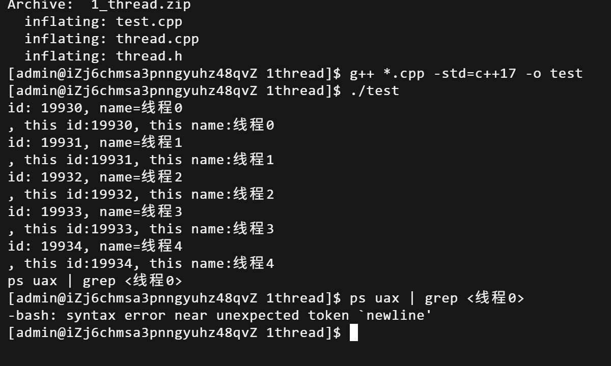

# 1Thread
实现了线程类，实现了关于设置线程名字，系统id，入口函数和执行函数的功能
## 本节知识
### thread_local
线程局部变量，每个线程独有的变量，只能在对应线程内使用，一般用法是`static thread_local`表示线程内部的静态变量，线程任何函数可以访问，在线程退出时自动释放
### syscall(SYS_getid)
是一个系统调用用于获取当前线程id(TID),进程是PID，获取的目的是为了更好的调试和监控或者可以记录日志的时候更加清楚知道是哪个线程产生的日志
### pthread_create
linux等操作系统创建线程的函数
`int rt = pthread_create(&m_thread, nullptr, &Thread::run, this);`
依次传入了线程句柄，线程属性，入口函数，线程指针,返回值是错误码，返回值为0说明创建成功，否则返回错误码
### pthread_detch
子线程脱离主线程管理，分离执行，确保线程在结束后能够正确地释放资源，而不需要主线程和其他线程进行join操作，主线程不需要担心其资源的释放
### pthread_join
等待一个线程的终止并回收它的资源

## thread.h
```
#ifndef _THREAD_H
#define _THREAD_H


#include <mutex>
#include<condition_variable>
#include<functional>
#include<string>

namespace sylar{

//信号量类
class Semaphore{
private:
std::mutex mtx;//互斥锁
std::condition_variable cv;//条件变量
int count;//信号量计数

public:

//构造函数，默认初始计数为0，explict防止隐式转换,防止C++的神人函数转化
explicit Semaphore(int count_=0) : count(count_){}


//P操作，申请信号量
void wait()
{
std::unique_lock<std::mutex> lock(mtx);//智能锁

while(count==0){//while防止虚假唤醒
    cv.wait(lock);//计数为0，进入等待状态，释放锁，线程休眠
}

//说明cv收到通知且count>0,可以申请一个信号量资源
count--;

}

//V操作，释放信号量
void signal()
{
std::unique_lock<std::mutex> lock(mtx); //加锁
count++;//释放资源，计数器加一
cv.notify_one();//如果count之前为0，唤醒P操作中的线程

}


};


//线程类
class Thread
{
public:

//构造函数声明，传入线程的回调函数和线程名
Thread(std::function<void()> cb,const std::string& name);
//析构函数声明
~Thread();

//获取线程系统id
pid_t getId() const {return m_id;}

//获取当前线程名字
const std::string& getName() const {return m_name;} 

//函数声明，等待当前线程执行完成
void join();

public:

//获取当前线程id
static pid_t GetThreadId();

//获取Thread类的指针
static Thread* GetThis();

//获取当前线程名字
static const std::string& GetName();

//设置当前线程名字
static void SetName(const std::string& name);

private:

//线程入口函数，arg为Thread类对象指针
static void* run(void* arg);

private:

pid_t m_id=-1;//线程系统ID，-1表示未创建
pthread_t m_thread=0;//线程句柄，0表示未创建

std::function<void()> m_cb;//回调函数callback
std::string m_name; //线程名字

Semaphore m_semaphore;//当前线程信号量

};


}

#endif
```

实现了信号量类的功能和线程类的一些函数声明，这里其实实现了两个获取线程id和获取线程名字，实际上功能是一样的，一个是作为静态函数直接获取，一个是需要通过对象调用的

## thread.cpp
```
#include "thread.h"

#include <sys/syscall.h>
#include <iostream>
#include<unistd.h>

namespace sylar{

//thread_local是线程局部存储
static thread_local Thread* t_thread =nullptr;//线程对象指针
static thread_local std::string t_thread_name ="unkown";//当前线程名称

//获取内核真实线程id
pid_t Thread::GetThreadId()
{
    return syscall(SYS_gettid);
}

//获取线程对象指针
Thread* Thread::GetThis()
{
    return t_thread;
}


//常量引用，避免拷贝与修改
const std::string& Thread::GetName()
{
    //获取当前线程名称
    return t_thread_name;
}

//设置当前线程名称
void Thread::SetName(const std::string &name)
{

if(t_thread) //如果当前线程对象存在
{
    t_thread->m_name=name;
    //通过指针修改对象内部名称
}
t_thread_name=name;//修改线程局部线程名称

}

//实现Thread的构造函数
Thread::Thread(std::function<void()> cb,const std::string &name):
//为成员变量赋值
m_cb(cb),m_name(name)
{
    //创建线程，传入线程句柄，线程属性，入口函数，线程对象指针并返回rt判断是否创建成功
    int rt=pthread_create(&m_thread,nullptr,&Thread::run,this);
    //返回值是0说明创建成功，反之则生成错误码
    if(rt)
    {

        std::cerr <<"线程创建失败,错误码=" << rt<<"线程名称：" << name;
        //抛出异常
        throw std::logic_error("线程创建失败");

    }

    //信号量P操作，申请信号量资源
    m_semaphore.wait();
}

//实现Thread的析构函数
Thread::~Thread()
{
    //如果线程已创建未join
    if(m_thread)
    {
        //分离线程
        pthread_detach(m_thread);
        m_thread=0;//置空线程句柄
    }


}

//线程等待函数
void Thread::join()
{
    if(m_thread)
    {
        //线程等待接口
        int rt=pthread_join(m_thread,nullptr);
        if(rt)
        {
            std::cerr << "线程等待失败，错误码=" <<rt <<"线程名=" << m_name;
            throw std::logic_error("线程等待错误");
        }
        m_thread=0;

    }
}


//Thread入口函数
//void*是万能指针
void* Thread::run(void* arg)
{
    //强制转换为Thread*类型
    Thread* thread =(Thread*) arg;

    t_thread=thread;//初始化线程局部存储变量
    t_thread_name=thread->m_name;
    thread->m_id=GetThreadId();//获取内核真实线程ID

    //设置线程别名
    pthread_setname_np(pthread_self(),thread->m_name.substr(0,15).c_str());

    std::function<void()> cb;//临时回调函数

    cb.swap(thread->m_cb);//交换临时回调函数对象和线程对象中的回调函数

    thread->m_semaphore.signal();//V操作，通知semaphore信号量，唤醒主线程的wait

    //调用传入的回调函数
    cb();

    return 0;//返回空指针

}


}

```
实现了线程类的一系列功能，这里实现的入口函数run，为了符合pthread_create的参数使用。回调函数是后续test.cpp编写的执行函数。

## test.cpp
```
#include "thread.h"
#include <iostream>
#include <memory>
#include <vector>
#include <unistd.h>

using namespace sylar;

//线程的业务执行函数，也就是我们传入的回调函数cb
void func()
{

//方式1 通过Thread的静态函数获取系统id和线程名
std::cout <<"id: " <<Thread::GetThreadId() <<", name=" << Thread::GetName()<<std::endl;

//方式2 通过Thread指针获取系统id和线程名
std::cout <<", this id:" <<Thread::GetThis()->getId() <<", this name:" <<Thread::GetThis()->getName()<<std::endl;

//线程休眠60秒，方便使用ps命令测试线程是否真实成功创建
sleep(60);


}

int main()
{
    //线程类数据类型智能指针数组
std::vector<std::shared_ptr<Thread>> thrs;

//创建5个线程
for(int i=0;i<5;i++)
{
    //创建指向线程的智能指针
 std::shared_ptr<Thread> thr =std::make_shared<Thread>(&func,"线程"+std::to_string(i));
    //加入数组中
 thrs.push_back(thr);

}


//等待所有线程执行完毕
for(int i=0;i<5;i++)
{
    //先创建全部线程让其并发运行，在统一等待
    thrs[i]->join();
    //你浪费一个人的60s在并发操作里面依旧是60s
}


return 0;
}

```
一个测试样例，功能是输出线程id和名字，然后等待60s，因为线程是在创建后共同执行，所以这里是等待60s而不是300s

## 输出结果

