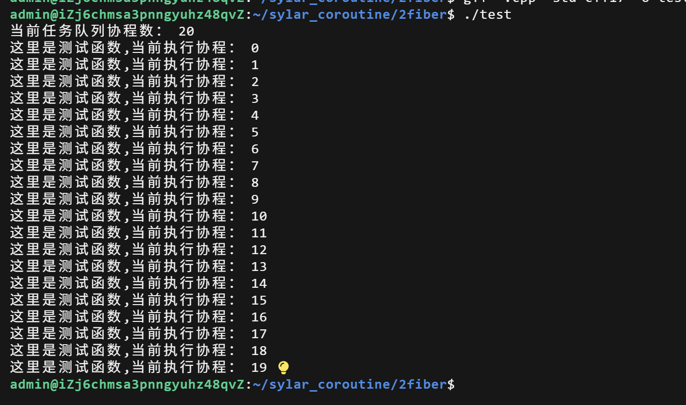
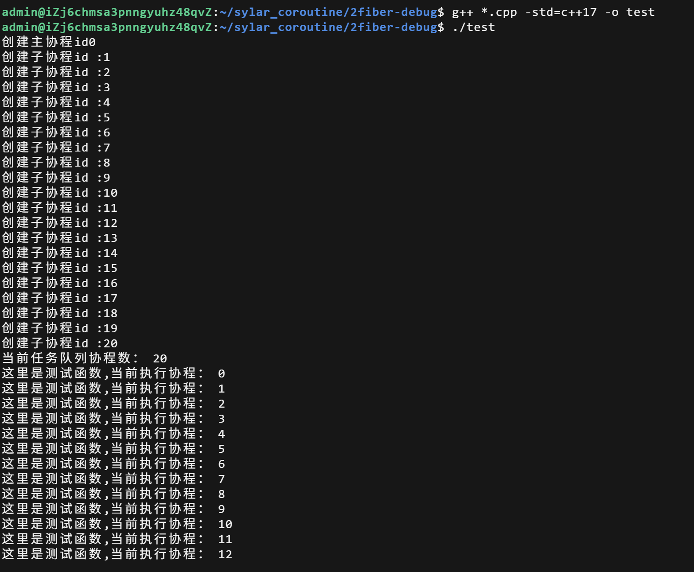
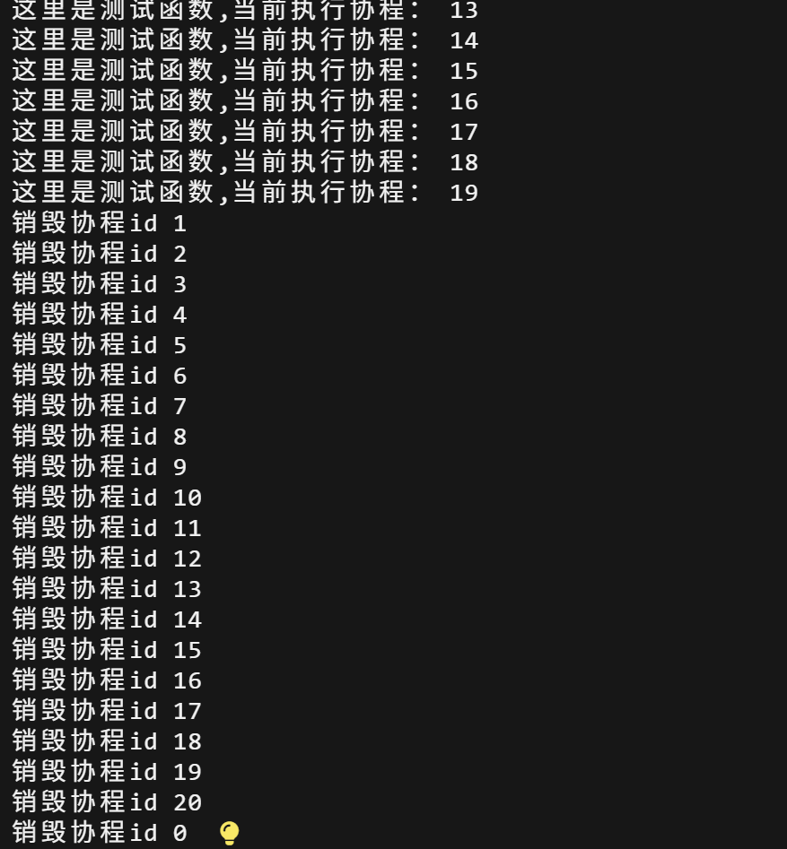

# 2Fiber
实现了协程类。提供了创建主协程，子协程以及其管理，切换，销毁的功能，使用`uncontext_t`结构保存，切换和恢复协程上下文，使用回调函数来传递和存储真正需要执行的逻辑
## 本节知识
### enable_share_from_this<类名>
属于基类模板，在类继承后会获得一个share_from_this()的方法，作用是避免内部指向该类的智能指针在离开作用域后错误释放内存，这是因为内部的智能指针并不能和外部的指向该类的指针共享计数器导致错误释放
在使用`std::shared_ptr<Fiber> self =this -> shared_from_this()`可以利用指向该类的裸指针this获取指向该类的智能指针self，这个self可以与外部指针共享计数器，避免了错误释放

### 主协程，子协程，调度协程
* 主协程：每个协程都会自带一个主协程，主协程是用无参构造函数构造的，没有回调函数需要执行，无独立栈内存，使用的栈内存是线程的栈内存
* 子协程：使用了有参构造函数构造的，有回调函数和独立栈内存，因为有业务回调函数，是真正做事的协程
* 调度协程：专门用于管理子协程的特殊协程，包含在协程调度器中，作用是管理子协程的执行和暂停，在代码中实现的协程是"非对称协程"。在子协程执行yield()后，让出CPU执行权。在没有专门的调度协程时，将执行权交给主协程，主协程作为调度协程；在有调度协程时，使用协程调度器将执行权交给调度协程

### 协程上下文ucontext_t  
`ucontext_t`本质上是一个保存程序执行上下文的结构体，核心作用：为用户态程序提供「上下文保存」和「上下文切换」的能力
对于协程库设置的协程上下文m_ctx
**相关API：**
* `getcontext(&m_ctx)`：获取当前上下文  
把当前程序的执行上下文，保存到传入的 `ucontext_t` 变量中；
* `makecontext(&m_ctx, entry, arg_num)`：修改上下文  
修改已获取的 ucontext_t 上下文，指定协程的入口函数和参数
* `swapcontext(&ctx_old, &ctx_new)`：切换上下文  
先把当前程序的上下文保存到` ctx_old` 中，再加载 `ctx_new` 的上下文并恢复运行  

**相关字段**
* uc_link:
     1. 类型：`ucontext_t*`，协程上下文指针
     2. 作用：指定当前协程执行完毕后，系统自动切换到的后继协程上下文。
     3. 如果赋值为某一个协程上下文指针，在协程执行完成后会自动切换到这个协程下运行。如果赋值为nullptr,表示协程没有后继上下文，需要手动调用yield来主动让出执行权  

* `uc_stack.ss_sp`
    1. 类型：void*万能引用
    2. 作用：指定协程栈内存的起始地址
* `uc_stack.ss_size`:
    1. 类型：size_t
    2. 作用：指定协程栈内存的大小（单位：字节）
## fiber.h
### 协程的状态
 在本协程中使用的是三状态模型，READY(就绪态)，RUNNING(运行态)，TERM(结束态)
 
|          状态          |                            含义                            |
| --------------------- | ---------------------------------------------------------- |
| **READY（就绪态）**   | 协程已经初始化或暂停，等待被调度执行（CPU 执行权不在它身上） |
| **RUNNING（运行态）** | 协程正在占用 CPU 执行（执行权在它身上）                     |
| **TERM（结束态）**    | 协程的回调函数已经执行完毕，生命周期结束，无法再被调度       |

 对于一个**协程**来说，当一个协程被创建或者执行`yield()`后，会进入READY就绪态，当协程执行`resume()`后，切换为RUNNING运行态，会进入入口函数`MainFunc()`,入口函数的功能之一就是调用我们的业务回调函数执行对应逻辑，在回调函数的运行过程中，我们可以随时使用`yield()`来暂停协程并保存上下文，此时协程再次进入READY就绪态。当回调函数运行结束后，再次调用`yield()`,会将协程进入结束态，结束态除非使用`reset()`重新绑定回调函数，否则不会回到READY就绪态或者RUNNING运行态
 
 对于一个协程完整的生命周期是  
 **生命周期**：对象创建（new）→ 初始化（READY）→ 多次 `resume/yield`（RUNNING↔READY）→ 执行完（TERM）→ 重置复用（reset→READY）→ 最终销毁（delete）。
### 代码
主要声明了创建主协程，创建子协程，销毁协程，暂停yield与恢复resume,入口函数的主要功能
以及获取协程id，运行状态，智能指针，设置当前运行协程与设置调度协程

 ```
#ifndef _COROUTINE_H_
#define _COROUTINE_H_

#include <iostream>
#include <memory>
#include <atomic>
#include <functional>
#include <cassert>
#include <ucontext.h>
#include <unistd.h>
#include <mutex>

namespace sylar{

class Fiber : public std::enable_shared_from_this<Fiber>
{
public:
enum State //枚举，定义协程三种状态
{
READY, //准备
RUNNING, //正在运行
TERM //运行结束
};

private:
Fiber();
//私有构造函数，禁止外部调用，只能使用本类中的GetThis()静态函数调用
//用于创建主协程


public:
Fiber(std::function<void()> cb,size_t stacksize =0,bool run_in_scheduler =true);
//构造函数，用于创建子协程
//参数1是传入的业务回调函数，参数2为协程栈的大小，默认为0使用后续函数实现的默认大小
//参数3是否交给协程调度器执行

~Fiber();//析构函数声明

void reset(std::function<void()> cb);//重置回调函数声明

void resume();//恢复/继续当前协程执行函数声明，获得CPU执行权

void yield();//暂停当前协程函数声明，让出CPU执行权

//获取协程id
uint64_t getId() const {return m_id;}

//获取当前协程运行状态
State getState() const {return m_state;}


public:
//设置当前运行的协程
static void SetThis(Fiber *f);

//获取当前协程的智能指针
static std::shared_ptr<Fiber> GetThis();

//设置当前线程的调度协程
static void SetSchedulerFiber(Fiber *f);

//获取当前正在运行的协程的唯一ID
static uint64_t GetFiberId();

//协程的入口函数
static void MainFunc();

private:
uint64_t m_id=0;//协程ID，初始设置为0

uint32_t m_stacksize =0;//协程运行时栈内存的大小

State m_state =READY;//协程运行状态，初始为准备状态

ucontext_t m_ctx;//协程上下文

void* m_stack =nullptr;//协程栈内存的起始地址指针，类型为万能指针

std::function<void()> m_cb;//协程要执行的回调函数

bool m_runInScheduler;//是否将当前协程交给调度协程


public:
std::mutex m_mutex;//互斥锁

};

}

#endif
 ```
 
## fiber.cpp
### ucontext_t的个人理解
对上述函数声明的实现，主要难点可能在ucontext_t的使用上，了解的也不是很多
我为大家尽力讲解我所理解的吧
首先在再次说明我们上下文切换的过程
1. 主协程初始化：`getcontext` 保存主协程的上下文到 t_thread_fiber->m_ctx；
2. 子协程创建：`getcontext` 初始化子协程上下文 → `makecontext` 绑定 `MainFunc` → 状态设为 READY；
3. `resume `切换：`swapcontext `保存主协程上下文 → 加载子协程上下文 → 执行 `MainFunc` → 调用回调函数；
4. `yield` 切换：`swapcontext` 保存子协程上下文 → 加载主协程上下文 → 子协程暂停；
5. 回调执行完：`MainFunc `把状态设为 TERM → `yield` 切回主协程 → 子协程上下文不再复用（除非 reset）。  
  
先不管上下文，我们思考一下入口函数MainFunc在哪里调用的，是`resume`还是`swapcontext`,答案都算不是。
实际上对于 CPU 来说，程序运行时，操作系统加载程序后会将 PC 地址初始化为main函数入口，CPU 从此开始执行，`swapcontext`相当于切换了主协程和子协程的上下文，现在指向子协程的PC地址(正确来说，我们在`makecontext`绑定了`MainFunc`,所以会从入口函数开始执行)，CPU就会从入口函数开始执行，当我们运行结束或者中间调用了yield函数，我们的上下文再次切换到主协程，CPU就会再次执行main函数接下来的内容了。
上下文，我们说了这么多，到底上下文是什么？我的理解是包含了协程的执行现场（比如栈上的局部变量、运行到哪一行）、程序计数器（PC）地址（可以说是让 CPU 干活的工位）、寄存器值、栈空间信息等等；
抱歉我也是协程库学习者，很多地方讲的可能不太清楚
### 代码
```
#include "fiber.h"

//调试模式
static bool debug =true;

namespace sylar{

//当前协程的裸指针
static thread_local Fiber* t_fiber =nullptr;

//主协程的智能指针
static thread_local std::shared_ptr<Fiber> t_thread_fiber =nullptr;

//设置线程的调度协程裸指针
static thread_local Fiber* t_scheduler_fiber = nullptr;

//全局原子操作变量 协程ID计数器
static std::atomic<uint64_t> s_fiber_id{0};

//当前程序创建总协程数量计数器
static std:: atomic<uint64_t> s_fiber_count{0};

//设置当前运行协程
void Fiber::SetThis(Fiber *f)
{
    t_fiber =f; //将协程指针传给线程局部变量
}

//获取当前协程的智能指针
std::shared_ptr<Fiber> Fiber::GetThis()
{
    //如果当前线程已经有运行的协程
    if(t_fiber)
    {
        //这个方法是模板类继承的，用于通过裸指针安全获得智能指针
        return t_fiber->shared_from_this(); 
    }

    //当前线程第一次调用该函数，说明还没有创建主协程
    else {
        //构造主线程对象
        //这种写法是因为make_shared方法并不能调用私有成员
         std::shared_ptr<Fiber> main_fiber(new Fiber());


         t_thread_fiber =main_fiber;

         //get函数是智能指针自带的函数，作用是返回裸指针
         t_scheduler_fiber=main_fiber.get();

         //确保当前运行协程指针指向刚创建的主协程
         assert(t_fiber == main_fiber.get());

         //返回智能指针
         return t_fiber ->shared_from_this();

    }

}

uint64_t Fiber::GetFiberId()
{
    //存在有运行的协程，直接返回ID
    if(t_fiber)
    {
        
        return t_fiber->getId();
    }
    else{
        //无运行协程，返回无效ID
        return (uint64_t)-1;
    }
}

//用于创建主协程的私有构造
Fiber::Fiber()
{
    SetThis(this); //传给线程局部变量

    m_state =RUNNING; //主协程维持运行状态

    //获取当前上下文，保存在主协程的m_ctx中
    //返回0成功，非0失败
    if(getcontext(&m_ctx))
    {
        std::cerr <<"获取上下文失败，协程主协程创建失败\n";
        pthread_exit(NULL);
    }

    m_id =s_fiber_id++;//主协程id

    s_fiber_count ++;//全局协程总数+1

    //调试模式下打印主协程id
    if(debug) 
        std:: cout <<"创建主协程id" << m_id <<std::endl;
}

//创建子协程函数,传入回调函数，栈大小，是否交给调度协程
Fiber::Fiber(std::function <void()> cb, size_t stacksize, bool run_in_scheduler):
m_cb(cb),m_runInScheduler(run_in_scheduler)
{
    m_state =READY;//子协程初始为准备状态

    //若输入非0选择输入栈空间大小，否则采用默认值
    m_stacksize=stacksize ? stacksize :128000;

    m_stack=malloc(m_stacksize);//申请空间，并且返回对应指针

    //获取上下文
    if(getcontext(&m_ctx))
    {
        std::cerr <<"子协程创建失败，获取上下文失败\n";
        pthread_exit(NULL);
    }

    m_ctx.uc_link =nullptr;//表示协程没有后继上下文，需要手动调用yield来让出执行权

    m_ctx.uc_stack.ss_sp=m_stack;//指定协程栈内存的起始地址

    m_ctx.uc_stack.ss_size = m_stacksize;//设置协程栈内存大小

    //修改m_ctx的上下文，当协程执行resume恢复时，会跳转到MainFunc函数开始执行
    makecontext(&m_ctx,&Fiber::MainFunc,0);

    //协程id自增
    m_id=s_fiber_id++;

    //协程计数器自增
    s_fiber_count++;

    //调试模式
    if(debug) 
        std::cout <<"创建子协程id :" <<m_id <<std::endl;

}

//实现析构函数
Fiber::~Fiber()
{

//协程计数器自减
s_fiber_count--;

if(m_stack)
{
    //释放对应栈空间
    free(m_stack);
}

if(debug)
    std::cout <<"销毁协程id " <<m_id <<std::endl;
}

//重置协程的回调函数
void Fiber::reset(std::function<void()> cb)
{
    //需要有独立栈内存且为结束态的协程才能重置
    assert(m_stack !=nullptr&&m_state==TERM);

    m_state=READY;//重置为就绪态

    m_cb=cb;//重置更新回调函数

    //重新绑定上下文
    if(getcontext(&m_ctx)){
        std::cerr << "获取上下文失败，回调函数重置失败\n";
        pthread_exit(NULL);
    }

    m_ctx.uc_link =nullptr;

    m_ctx.uc_stack.ss_sp=m_stack;

    m_ctx.uc_stack.ss_size = m_stacksize;

    makecontext(&m_ctx,&Fiber::MainFunc,0);

}

//恢复执行协程
void Fiber::resume()
{

    assert(m_state==READY);//只有就绪态的协程才能恢复执行

    m_state=RUNNING;//切换为运行态

    //如果当前协程需要交给调度协程调度
    if(m_runInScheduler)
    {
        SetThis(this);//标记当前运行协程为本协程，将执行权交给本协程

        //上下文切换，把CPU执行权从调度协程切换到当前子协程
        //调度协程的上下文被保存，子协程的上下文被加载
        if(swapcontext(&(t_scheduler_fiber->m_ctx),&m_ctx))
        {
            std::cerr <<"上下文切换失败,当前协程恢复失败\n";
            pthread_exit(NULL); 
        }

    }
    //无调度协程，说明主协程作为调度协程
    else{
        SetThis(this);

        if(swapcontext(&(t_thread_fiber->m_ctx),&m_ctx))
        {
            std::cerr <<"上下文切换失败,当前协程恢复失败\n";
            pthread_exit(NULL); 
        }
    }
}

//让出CPU执行权，暂停运行
void Fiber::yield()
{
    //只有处于运行态或者结束态的协程才能让出执行权
    assert(m_state==RUNNING || m_state==TERM);

    //如果协程不是结束态，说明是主动暂停，将状态修改为就绪态，等待下次调用
    if(m_state!=TERM)
    {
        m_state=READY;
    }

    //同样检查是否需要交给调度协程，但操作与resume相反
    if(m_runInScheduler)
    {
        SetThis(t_scheduler_fiber);//交给调度协程

        if(swapcontext(&m_ctx,&(t_scheduler_fiber->m_ctx)))
        {
            std::cerr <<"上下文切换失败,协程暂停失败\n";
            pthread_exit(NULL);
        }

    }
    else
    {
        SetThis(t_thread_fiber.get());//交给主协程,因为这里是智能指针，需要传入裸指针

        if(swapcontext(&m_ctx,&(t_thread_fiber->m_ctx)))
        {
            std::cerr <<"上下文切换失败,协程暂停失败\n";
            pthread_exit(NULL);
        }
    }
}

void Fiber::MainFunc()
{
    std::shared_ptr<Fiber> curr =GetThis();//获取当前协程的智能指针

    //是否获取有效协程指针
    assert(curr!=nullptr);

    curr->m_cb();//执行传入的回调函数，这是协程核心要做的事情

    curr->m_cb = nullptr;//执行完成后清空回调函数

    curr->m_state=TERM;//执行完成后进入结束态

    auto raw_ptr =curr.get();//获取当前协程裸指针,因为curr要被重置了

    //重置智能指针,释放对当前协程的管理，这是智能指针自带的方法，并非上面的回调函数重置方法
    //因为在这里智能指针离开作用域就会释放内存，重置智能指针以防止
    curr.reset();

    raw_ptr->yield();//调用yield暂停，让出执行权


}

}
```

## test.cpp
实现了一个简易的任务调度器，使用任务调度器按顺序将各个子协程加入任务队列，并且依次执行

```
#include "fiber.h"
#include<vector>

using namespace sylar;

//协程任务调度器,这里实现了一个简易的任务管理器，我们后续会实现一个完整的
class Scheduler
{
public:

    //将待执行协程加入任务队列
    void schedule(std::shared_ptr<Fiber> task)
    {
        m_tasks.push_back(task);
    }

    void run()
    {
        std::cout <<"当前任务队列协程数：" <<m_tasks.size() <<std::endl;

        std::shared_ptr<Fiber> task;//协程智能指针

        auto it =m_tasks.begin();//任务队列起始迭代器

        while(it!=m_tasks.end())
        {
            task =*it;//迭代器解引用，获取当前位置的智能指针

            task->resume();//恢复当前协程，执行当前协程回调函数
            it++;//迭代器自增后移
        }
        m_tasks.clear();
    }

private:
    std::vector<std::shared_ptr<Fiber>> m_tasks;//任务队列

};

//协程要执行的业务函数
void test_fiber(int i)
{
    std::cout <<"这里是测试函数,当前执行协程：" << i<<std::endl;
}

int main()
{
    Fiber::GetThis();//第一次调用会创建主协程

    Scheduler sc;//调度器实例

    for(int i=0;i<20;i++)
    {   
        //bind可以生成可调用的回调函数对象
        //传入回调函数，栈内存（这里是默认）,不使用调度协程（交给主协程管理）
        std::shared_ptr<Fiber> fiber =std::make_shared<Fiber>(std::bind(test_fiber,i) ,0, false);

        sc.schedule(fiber);//将任务加入任务队列
    }
    sc.run();

    return  0;


}
```

## 输出结果



