# 3Scheduler
实现了协程调度器，用于管理不同线程的不同协程的任务处理。虽然我们在fiber模块里面实现了一个单线程调度器。本节实现了可以自由创建多线程的协程调度器，可以执行并行与并发的任务。简单来说就是将需要操作的任务丢给机器去处理，避免每一次都需要实现复杂的线程和协程逻辑。

我尽量从各种我认为的困难点出发解释

## 字段解释
### use_caller
我们需要实现以下几种模式：
* 单线程模式：主线程作为工作线程
* 多线程模式：主线程不作为工作线程
* 多线程模式：主线程作为工作线程

其中的关键是**use_caller** :主线程是否作为工作线程。如果为false，因为主线程不作为工作线程，我们必须创建子线程来调度处理任务。如果为true，主线程作为工作线程，如果是单线程，没有必要创建新的子线程，直接将主线程作为工作线程即可。如果是多线程，需要创建的线程数-1（因为主线程已经作为了工作线程）
注意use_caller会影响需要创建的线程数，是否在主线程创建主协程，stop函数的断言等等

**use_caller==false**
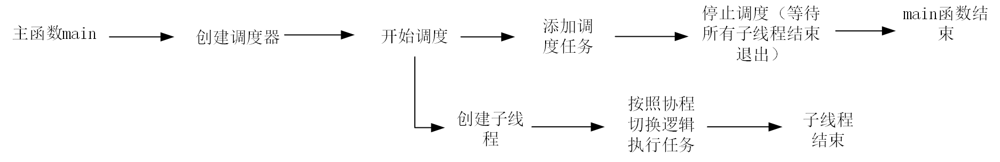
**use_caller==true**


### m_runScheduler
我们在上一节学习到的，是否实现调度协程。true时在运行时会在调度协程和子协程之间切换，会保存调度协程、子协程、主协程的上下文。false时，实际上可以理解为把主协程当做调度协程使用，会在主协程和子协程之间切换，保存主协程和子协程的上下文

其他关键字段代码中也有详细解释

## scheduler.h
### 代码
```
#ifndef _SCHEDULER_H_
#define _SCHEDULER_H_

#include "fiber.h"
#include "thread.h"

#include <mutex>
#include <vector>

namespace sylar{

//调度器类
class Scheduler
{
public:

//构造函数声明，threads为工作线程数量 use_caller为是否将主线程作为工作线程
Scheduler(size_t threads=1, bool use_caller =true,const std::string& name="Scheduler");

virtual ~Scheduler();//虚函数析构函数，是为了防止父类销毁子类对象时销毁不完全而需要实现多态

//获取调度器名称
const std::string& getName() const {return m_name;}


public:

//获取正在运行的调度器指针
static Scheduler* GetThis();

protected:
//设置正在运行的调度器
void SetThis();

public:
//任务添加函数
//使用模板是因为需要加入的任务可能是线程或者回调函数
//FiberOrCb表示协程(fiber)或回调函数(callback)
template <class FiberOrCb>
void scheduleLock(FiberOrCb fc ,int thread =-1)
{
bool need_tickle; //用于标记任务队列是否为空，从而判断是否需要唤醒线程
{ //仅仅是作用域，为了方便在作用域里面加锁
    std:: lock_guard<std::mutex> lock(m_mutex);//为作用域加锁

    need_tickle =m_tasks.empty();//检查任务队列是否为空

    ScheduleTask task(fc,thread);//调度器任务对象

    if(task.fiber || task.cb) //只要存在有效线程或者有效回调函数
    {
        m_tasks.push_back(task);//将任务加入任务队列

    }
}

if(need_tickle)
{
    tickle();//唤醒空闲线程
}

}

virtual void start();//虚函数 启动线程池 启动调度器

virtual void stop();//虚函数 关闭线程池 关闭调度器

protected:

virtual void tickle(); //唤醒空闲的工作线程

virtual void run();//线程执行函数

virtual void idle();//空闲协程函数，当任务队列为空，工作线程切换到空闲协程执行，避免线程空转

virtual bool stopping();//判断调度器是否可以停止

bool hasIdleThreads(){return m_idleThreadCount>0;}

private:

//调度器任务结构体
struct ScheduleTask
{
    std::shared_ptr<Fiber> fiber;//协程智能指针
    std::function<void()> cb;//回调函数
    int thread;// 指定任务需要运行的线程id

    //无参构造函数，用于初始化任务
    ScheduleTask()
    {
        fiber=nullptr;
        cb=nullptr;
        thread =-1;
    }

    //带协程的构造函数
    ScheduleTask(std::shared_ptr<Fiber> f,int thr)
    {
        fiber=f;
        thread=thr;
    }

    //实际上传入了协程智能指针的普通指针
    ScheduleTask(std::shared_ptr<Fiber>* f,int thr)
    {
        //对f解引用，swap是智能指针自带的方法，作用是交换内部资源，交换了两个智能指针，保证引用计数不会增加
        fiber.swap(*f);
        thread=thr;
    }

    //带回调函数的构造函数
    ScheduleTask(std::function<void()> callback,int thr)
    {
        cb=callback;
        thread=thr;
    }

    //同理，传入了回调函数的指针
    ScheduleTask(std::function<void()> *callback,int thr)
    {
        cb.swap(*callback);//回调函数也有swap方法，交换内部资源
        thread=thr;
    }

    //重置任务
    void reset()
    {
        fiber=nullptr;
        cb=nullptr;
        thread=-1;
    }
};

private:
std::string m_name; //调度器名称
std::mutex m_mutex;//互斥锁
std::vector<std::shared_ptr<Thread>> m_threads; //工作线程池
std::vector<ScheduleTask> m_tasks;//任务队列
std::vector<int> m_threadIds; //工作线程id集合
size_t m_threadCount =0;//工作线程总数
std::atomic<size_t> m_activeThreadCount {0};//活跃线程数
std::atomic<size_t> m_idleThreadCount{0};//空闲线程数

bool m_useCaller;//是否将主线程作为工作线程
std::shared_ptr<Fiber> m_schedulerFiber;//调度协程
int m_rootThread =-1;//主线程id
bool m_stopping =false; //调度器停止标记


};


}

# endif
```
### 一些解析
* 可以看到这个头文件实际上有很多虚函数，因为虚函数支持之类重写，可以根据具体情况去实现符合的调度器

* scheduleLock 任务提交函数的 thread 参数默认值为 - 1，代表该任务为全局任务，由所有工作线程竞争执行

* 在这里我们首次见到了tickle（）唤醒函数，它的功能是唤醒空闲线程，一般来说是将空闲协程执行的idle逻辑中切换到工作协程，也就是执行yield函数交出执行权，我们后面会具体描述的

* 对于ScheduleTask，我们需要处理两种主要形式 协程/回调函数，带协程的和带回调函数的，实际上带回调函数的任务在运行函数run中也会将回调函数封装入协程中

## scheduler.cpp

###  代码
```
#include "scheduler.h"

static bool debug =true; //调试

namespace sylar{

static thread_local Scheduler* t_scheduler =nullptr;//线程局部变量，当前线程调度器裸指针

//获取当前线程调度器指针
Scheduler* Scheduler::GetThis()
{
    return t_scheduler;
}

//设置当前线程调度器
void Scheduler::SetThis()
{
    t_scheduler=this;//绑定当前线程调度器
}


//构造函数 传入工作线程数量，是否将主线程当做工作线程，线程名
Scheduler::Scheduler(size_t threads,bool use_caller,const std::string &name):
m_useCaller(use_caller),m_name(name)
{
    //断言，判断工作线程必须大于0，当前线程并没有绑定任何调度器(避免重复初始化)
    assert(threads >0 && Scheduler::GetThis()==nullptr);

    SetThis();//设置当前调度器对象

    Thread::SetName(m_name);//设置当前线程名为调度器名称

    //使用主线程为工作线程
    if(use_caller)
    {
        // 因为主线程担任一个工作线程的责任，所以工作线程数减一
        threads --;

        //创建主协程，Fiber类里面的GetThis在首次调用时会创建主协程
        Fiber::GetThis();
        // m_schedulerFiber是调度协程智能指针，使用了智能指针的reset函数，创建调度器专属调度协程
        m_schedulerFiber.reset(new Fiber(std::bind(&Scheduler::run,this),0,false));

        Fiber::SetSchedulerFiber(m_schedulerFiber.get());//获取调度协程裸指针，设置为当前协程的调度协程

        m_rootThread=Thread::GetThreadId();//记录主线程ID

        m_threadIds.push_back(m_rootThread);//加入工作线程ID集合
    }

    m_threadCount =threads;//初始化调度器的工作线程总数

    if(debug) 
        std::cout << "构造调度器成功\n";

}

//调度器析构函数
Scheduler::~Scheduler()
{

//调度器必须处于停止状态才能析构
assert(stopping()==true);

if(GetThis()==this) //如果当前线程的调度器是当前实例
{
     //将线程局部变量的调度器指针置空，解除线程与调度器的绑定
    t_scheduler=nullptr;
}

if(debug) 
    std::cout <<"调度器析构成功\n";
}

//启动调度器
void Scheduler::start()
{

    std::lock_guard<std::mutex> lock(m_mutex); //线程锁

    if(m_stopping) //调度器已经暂停不允许启动
    {
        std::cerr<<"调度器已经暂停" << std::endl;
        return ;
    }

    assert(m_threads.empty()); //工作线程池必须为空，防止重复创建多个线程池

    m_threads.resize(m_threadCount);//线程池调整为工作线程数

    //遍历工作线程池
    for(size_t i=0;i<m_threadCount;i++)
    {
        //创建工作线程，重置智能指针的管理内存,传入了调度器的运行函数run作为线程的回调函数参数
        m_threads[i].reset(new Thread(std::bind(&Scheduler::run,this),m_name+"_"+std::to_string(i)));

        //加入工作线程ID集合
        m_threadIds.push_back(m_threads[i]->getId());
    }
    if(debug) 
        std::cout<<"调度器启动成功\n";
}

//运行函数，所有工作线程的入口函数(以及作为工作线程的主线程)
void Scheduler::run()
{
    int thread_id =Thread::GetThreadId();//获取当前线程id，GetThreadId是类中的静态函数

    if(debug)
        std::cout <<"当前执行调度器run函数的线程id为 :" <<thread_id <<std::endl;

        //set_hook_enable(true);//暂时不知道功能

        SetThis();//设置调度器对象

        if(thread_id!=m_rootThread) //不是主线程,可能没有创建主协程,主线程的主协程在构造调度器时已经创建
        {
            Fiber::GetThis();//初始调用GetThis会创建主协程

        }

        //创建空闲协程，绑定idle成员函数
        std::shared_ptr<Fiber> idle_fiber =std::make_shared<Fiber>(std::bind(&Scheduler::idle,this));

        ScheduleTask task;//定义当前任务对象

        while(true)
        {
            task.reset();//重置任务对象，防止上一次任务残留

            bool tickle_me=false; //标记是否唤醒了其他线程进行任务调度

            {//添加作用域便于加锁
                std::lock_guard<std::mutex> lock(m_mutex);//互斥锁

                auto it =m_tasks.begin();//迭代器

                while(it!=m_tasks.end())
                {
                    //为了查找是否存在其他线程的任务存在，-1是一个默认值
                    if(it->thread!=-1 && it->thread!=thread_id)
                    {
                        it++;
                        tickle_me =true;//出现其他线程的任务,修改标记
                        continue; //继续查询，先不执行下面内容
                    }

                    assert(it->fiber || it->cb);//需要存在有效协程或者有效回调函数
                    task =*it;//获取找到的当前任务
                    m_tasks.erase(it);//弹出当前任务
                    m_activeThreadCount++;//活跃线程数+1，当前线程开始处理任务
                    break;;//已经找到当前任务不需要继续查找
                }
                tickle_me =tickle_me || (it!=m_tasks.end());//更新tickle_me标记
            }
                if(tickle_me)
                {
                    tickle();//使用tickle函数唤醒其他线程
                }

            //任务是协程对象
            if(task.fiber)
            {
                {//添加作用域便于加锁
                    std::lock_guard <std::mutex> lock (task.fiber->m_mutex);//互斥锁
                    if(task.fiber->getState()!=Fiber::TERM) //保证不是处于终止状态的协程
                    {
                        task.fiber->resume();//恢复协程执行
                    }
                }

                m_activeThreadCount--;//协程运行结束后活跃线程-1
                task.reset();//重置任务对象

            }

            //任务是回调对象
            else if(task.cb)
            {
                //对于回调函数的处理，实际上是封装成协程对象，按照协程的形式处理
                //以下内容同上
                std::shared_ptr<Fiber> cb_fiber =std::make_shared<Fiber>(task.cb);
                {  
                    std::lock_guard<std::mutex> lock(cb_fiber->m_mutex);
                    cb_fiber->resume();
                }
                m_activeThreadCount--;//活跃线程数-1
                task.reset();
            }

            //无有效任务时,实际上应该是任务队列为空时task为初始化
            else
            {
                //会切换到空闲协程
                //当对应空闲协程进入终止态即结束死循环
                if(idle_fiber->getState()==Fiber::TERM)
                {
                    if(debug)
                        std:: cout <<"调度器run函数结束于线程 :" <<thread_id <<std::endl;
                        break;
                }
                m_idleThreadCount++;
                idle_fiber->resume();//切换到空闲协程
                m_idleThreadCount--;
            }

        } //while(true)死循环

} //run函数

//停止调度器
void Scheduler::stop()
{
    if(debug)
        std::cout << "调度器stop函数开始于 线程:" <<Thread::GetThreadId() <<std::endl;

        //调度器已经处于可停止状态返回即可，防止重复停止
    if(stopping())
    {
        return ;
    }

    m_stopping =true;//标记为停止状态

    assert(GetThis()==this);

    //存在调度协程
    if(m_schedulerFiber)
    {
        tickle();
    }

    //貌似tickle()是一次性唤醒所有空闲线程，这里只是稳妥起见在重复唤醒


    //存在调度协程
    if(m_schedulerFiber)
    {
        m_schedulerFiber->resume();

        if(debug)
            std::cout <<"调度协程结束于线程 :" <<Thread::GetThreadId() <<std::endl;
    }

    //临时线程容器
    std::vector<std::shared_ptr<Thread>> thrs;
    {
        std::lock_guard<std::mutex> lock(m_mutex);

        thrs.swap(m_threads);//交换临时线程容器和工作线程池，使工作线程池清空
    }

    //等待所有工作线程执行完成
    for(auto &i : thrs)
    {
        i->join();//等待当前线程执行完成
    }

    if(debug)
        std:: cout <<"调度器stop函数结束于线程 :" <<Thread::GetThreadId() <<std::endl;

}

void Scheduler::tickle(){
    //暂不实现，根据具体情况实现具体唤醒函数
    //tickle函数的作用是实际上是对所有线程的无差别通知，总之是改变处于空闲阻塞状态的线程
}


//空闲协程执行逻辑,切换到空闲协程之后，防止协程进入while死循环空转
void Scheduler::idle()
{
    //只要调度器不停止就一直执行
    while(!stopping())
    {
        if(debug) 
            std::cout <<"调度器idle,休眠在线程 :" << Thread::GetThreadId() <<std::endl;
        
            sleep(1);//休眠一秒，让出CPU执行权

            Fiber::GetThis()->yield();//空闲协程需要让出执行权
    }
}

//判断调度器是否可以停止
bool Scheduler::stopping()
{
    std::lock_guard<std::mutex> lock(m_mutex);
    
    //需要满足三个条件 停止标记、任务队列为空、无活跃线程
    return m_stopping && m_tasks.empty()&& m_activeThreadCount==0;

}


}
```

看起来代码量还不少，我尽量解释我知道的
### 解析
#### 关于run函数与while(true)
运行函数run是所有工作线程和调度协程的入口，是调度器的核心调度逻辑实现函数。

首先要说明的是函数内包含两层核心循环 —— 外层为while(true)主调度死循环，内层为基于迭代器的任务队列遍历循环。

以下是对于run循环的全部解释：
1. 获取当前线程id
2. 创建空闲协程，绑定idle成员函数。空闲协程是任务队列中无当前线程的任务时切换的。空闲协程是为了防止CPU在线程中空转，并且可以通过tickle（）唤醒
3. 定义待处理的任务对象task
4. 以下是while(true)循环
    1. 重置任务，重置唤醒标记
    2. 对任务队列task进行迭代器迭代，在遍历中应该具有以下功能
        1. task获取当前线程任务
        2. 将要执行的任务弹出任务队列
        3. 自增活跃线程，因为接下来当前线程要开始处理任务了
        4. 跳出迭代器while循环
     3.tickle_me的设置，当前面有其他线程或者没有遍历到最后一个任务时都要设置为true
     4. 获取任务后根据任务类型执行相应操作，对于协程类型直接执行resume（）执行，对于回调函数类型，封装成协程然后执行即可
     5. 当无有效任务时，一般是因为任务队列中无当前线程的任务时。分为两种情况讨论，一种是，没有stopping()调度器结束判断函数，也就是对于空闲函数还没有进入终止态，切换当前线程上下文到空闲协程，防止CPU在while死循环里面空转了。另一种是调度器执行stop函数，任务为空，并且也不会在有活跃线程。简单来说就是大家都收工回家了，我们这个线程也不该待在空闲线程摆烂了，直接结束回收资源。
#### 关于stop函数与stop中的断言
```
  //将主线程作为工作线程的情况下
    if(m_useCaller)
    {
        assert(GetThis()==this);
    }
    else
    {
        assert(GetThis()!=this);
    }
```
首先说出这里原作者代码的错误，这里的断言检验是错误的，和其他人的检验是一样的，并不能写出  assert(GetThis()!=this)这样的断言，希望各位再仔细理解一下线程局部变量和这段代码的绑定问题
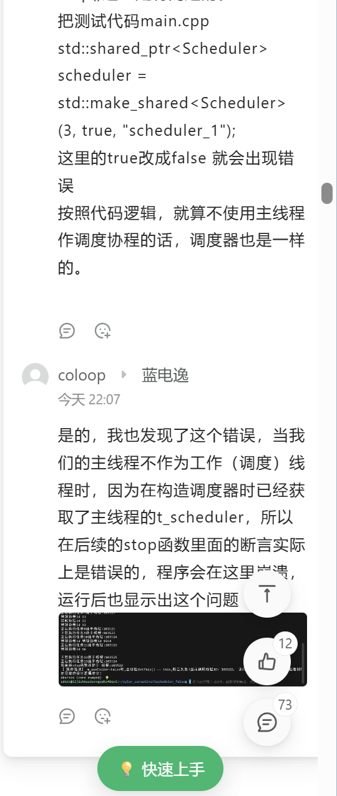


各位要是不相信我可以列出sylar大佬的源代码，并没有这样的断言
```
void Scheduler::stop() {
    m_autoStop = true;
    if(m_rootFiber
            && m_threadCount == 0
            && (m_rootFiber->getState() == Fiber::TERM
                || m_rootFiber->getState() == Fiber::INIT)) {
        SYLAR_LOG_INFO(g_logger) << this << " stopped";
        m_stopping = true;

        if(stopping()) {
            return;
        }
    }

    //bool exit_on_this_fiber = false;
    if(m_rootThread != -1) {
        SYLAR_ASSERT(GetThis() == this);
    } else {
        SYLAR_ASSERT(GetThis() != this);
    }

    m_stopping = true;
    for(size_t i = 0; i < m_threadCount; ++i) {
        tickle();
    }

    if(m_rootFiber) {
        tickle();
    }

    if(m_rootFiber) {
        //while(!stopping()) {
        //    if(m_rootFiber->getState() == Fiber::TERM
        //            || m_rootFiber->getState() == Fiber::EXCEPT) {
        //        m_rootFiber.reset(new Fiber(std::bind(&Scheduler::run, this), 0, true));
        //        SYLAR_LOG_INFO(g_logger) << " root fiber is term, reset";
        //        t_fiber = m_rootFiber.get();
        //    }
        //    m_rootFiber->call();
        //}
        if(!stopping()) {
            m_rootFiber->call();
        }
    }

    std::vector<Thread::ptr> thrs;
    {
        MutexType::Lock lock(m_mutex);
        thrs.swap(m_threads);
    }

    for(auto& i : thrs) {
        i->join();
    }
    //if(exit_on_this_fiber) {
    //}
}

void Scheduler::setThis() {
    t_scheduler = this;
}
```

总之各位要是看到这里，我已经把断言部分修改了，我不敢去评价任何一位互联网从业者，仅仅是将我认为不对的地方提出而已

#### 关于tickle与空闲协程
请各位理性看待我的任何解释，再次声明我只是代码初学者，解释仍然可能有误
首先如果各位学习的是这份代码，可以看出tickle实际上什么都没有实现，这是正常的，因为tickle()实际上的唤醒空闲协程，比如我们的idle函数里面有一个读入操作read()，只要不读取，当前线程就会一直卡在空闲协程，就不会执行run函数闹里面的while(true)死循环了。但是我们的idle函数明显更简单
```
//空闲协程执行逻辑,切换到空闲协程之后，防止协程进入while死循环空转
void Scheduler::idle()
{
    //只要调度器不停止就一直执行
    while(!stopping())
    {
        if(debug) 
            std::cout <<"调度器idle,休眠在线程 :" << Thread::GetThreadId() <<std::endl;
        
            sleep(1);//休眠一秒，让出CPU执行权

            Fiber::GetThis()->yield();//空闲协程需要让出执行权
    }
}
```
实际上我们在睡眠一秒后（这一秒可能对于协程处理足够长了）就会交出CPU执行权，这时候执行权在调度协程还是在其他子协程就不管空闲协程的事了
#### 关于如何运行的再解释
本来想自己解释的，但是这里已经流程讲的很清楚了，我就不搞晕大家了  
[重写Sylar基于协程的服务器（4、协程调度模块的设计）](https://blog.csdn.net/m0_52566365/article/details/135991331)
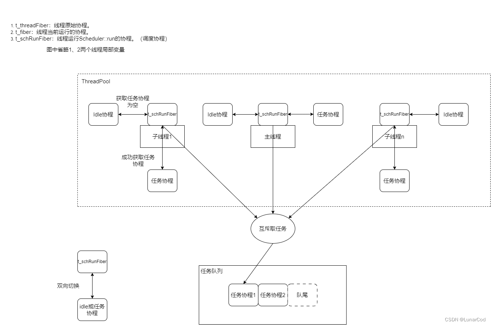

## main.cpp
```
#include "scheduler.h"

using namespace sylar;

static unsigned int test_number =0;

std::mutex mutex_cout;//互斥锁

//任务函数
void task()
{

{
    std::lock_guard<std::mutex> lock(mutex_cout);

    std::cout <<"正在执行任务," <<test_number++ <<"处于线程:" << Thread::GetThreadId() <<std::endl;

}
sleep(1);//休眠一秒

}

int main(int argc,char const *argv[])
{
    {
    //构造调度器，总工作线程3，使用主线程作为工作线程
    std::shared_ptr<Scheduler> scheduler =std::make_shared<Scheduler> (3,true,"调度器1");

    scheduler->start();

    sleep(2);

    std::cout << "首次提交任务\n\n";

    for(int i=0;i<5;i++)
    {
        //任务，创建协程对象，将task函数封装在任务中
        std::shared_ptr<Fiber> fiber =std::make_shared <Fiber>(task);

        //添加任务到任务队列中,这里我们并未指定线程id，会使用默认值-1，这实际上说明任务是线程竞争执行的
        scheduler->scheduleLock(fiber);
    }

    sleep(6);

    std::cout <<"再次提交任务\n\n";

    for(int i=0;i<15;i++)
    {
        std::shared_ptr<Fiber> fiber =std::make_shared<Fiber>(task);

        scheduler->scheduleLock(fiber);
    }

    sleep(3);

    scheduler->stop();

    }

}
```

简单实现了一个业务函数task，分为两次提交我们的任务，一次是5次，一次是15次。


## 输出结果
注意在编译时执行这段  
`g++ *.cpp -std=c++17 -o test`
### 多线程不使用主线程作为工作线程  
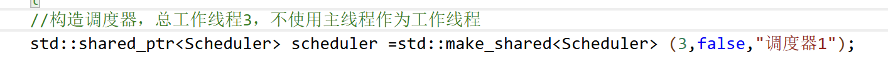
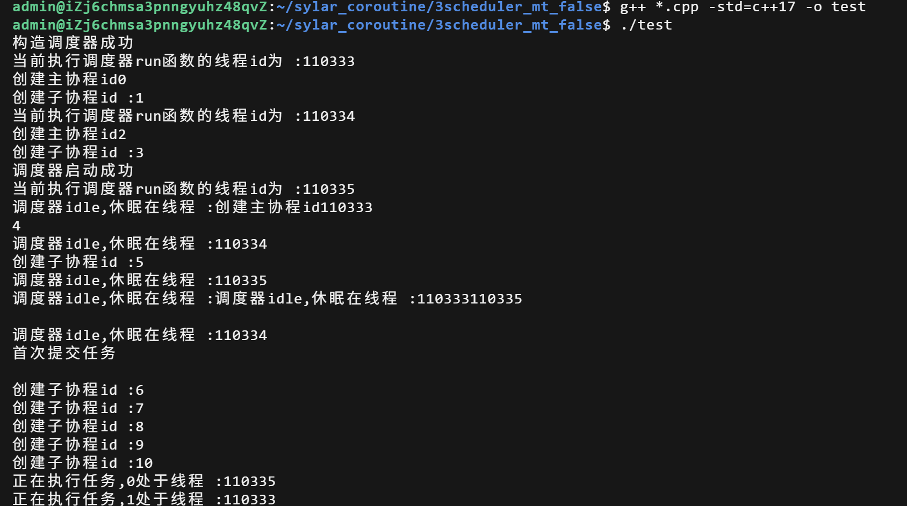

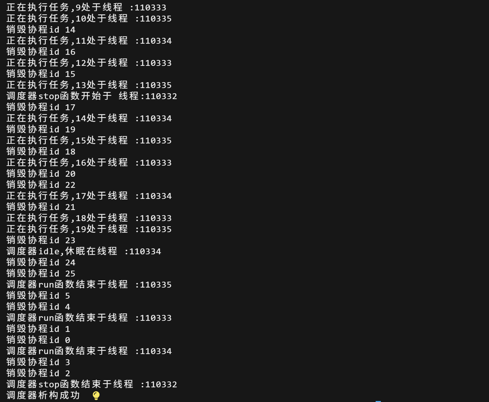

### 单线程使用主线程作为工作线程
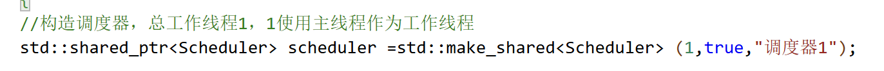
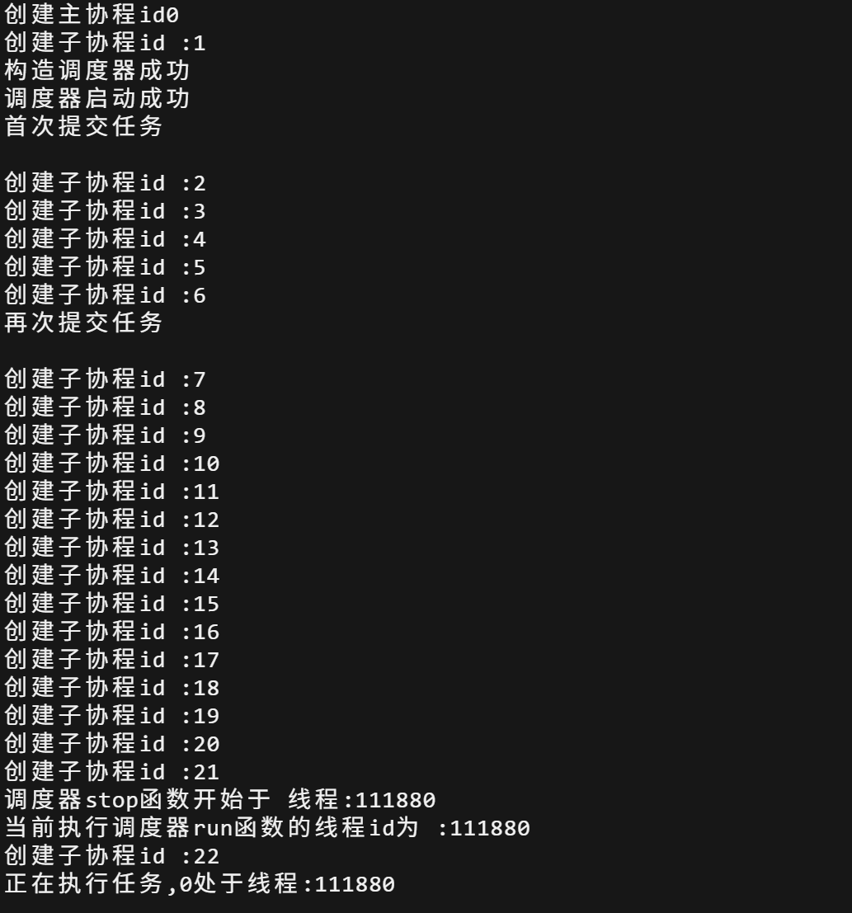
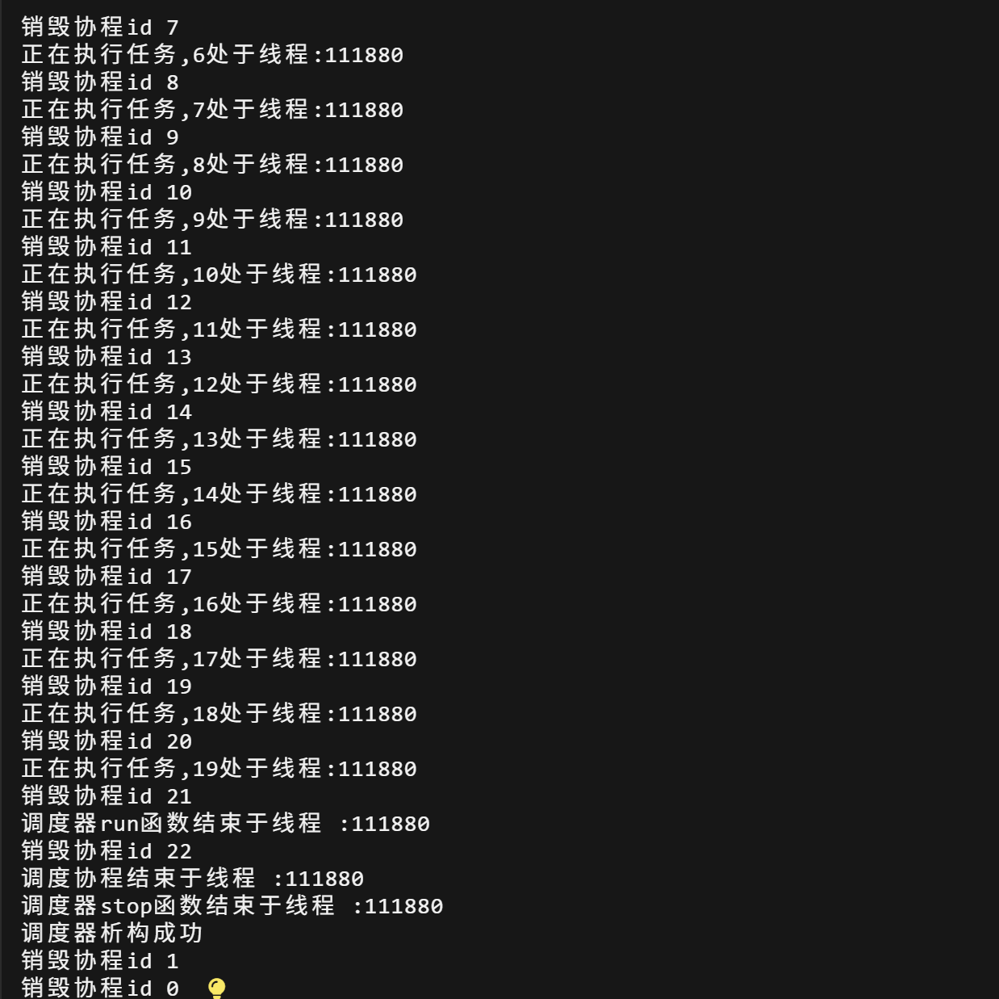

### 多线程使用主线程作为工作线程
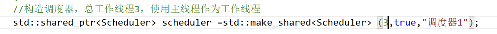

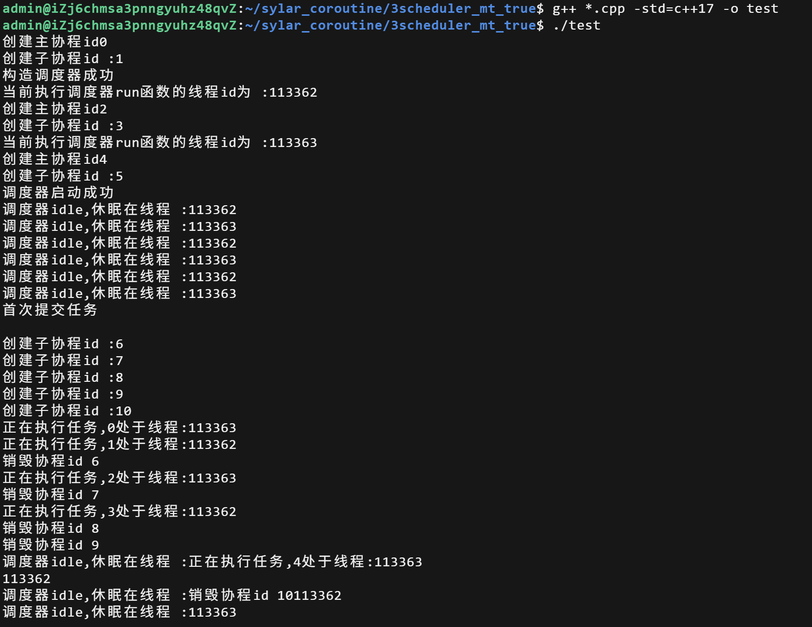

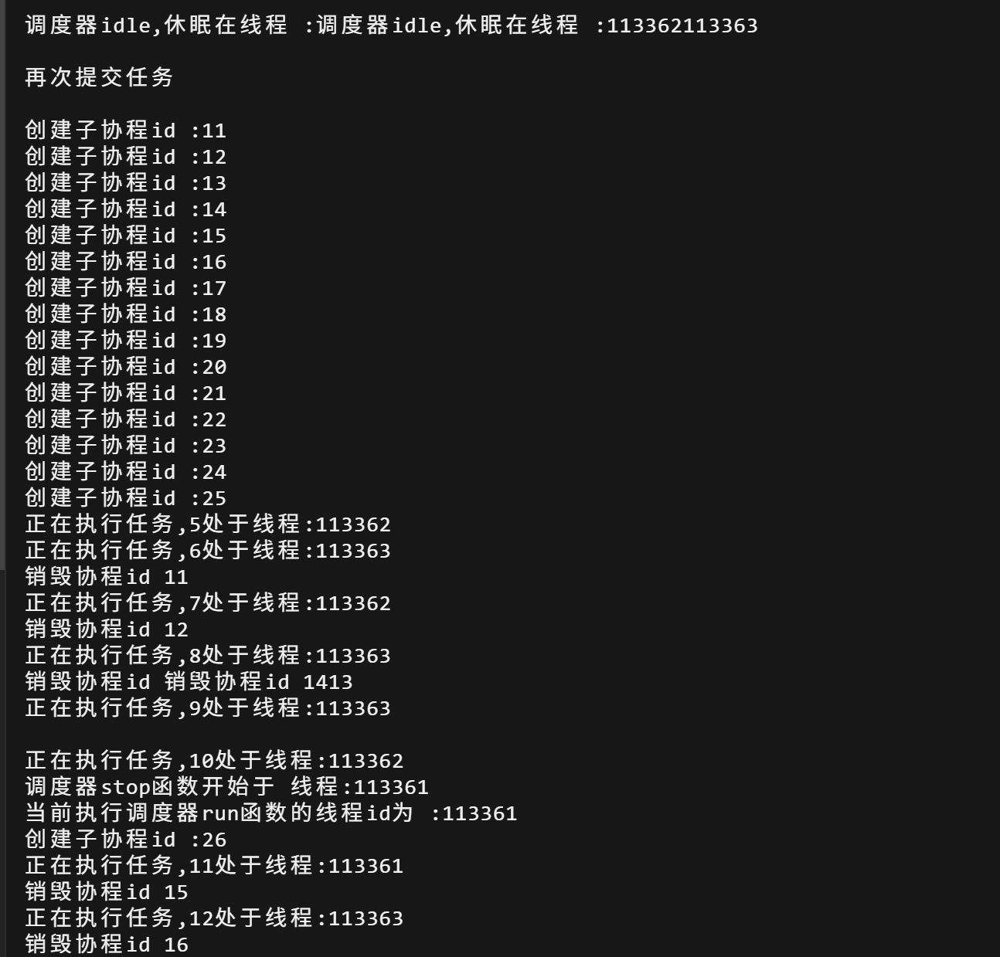

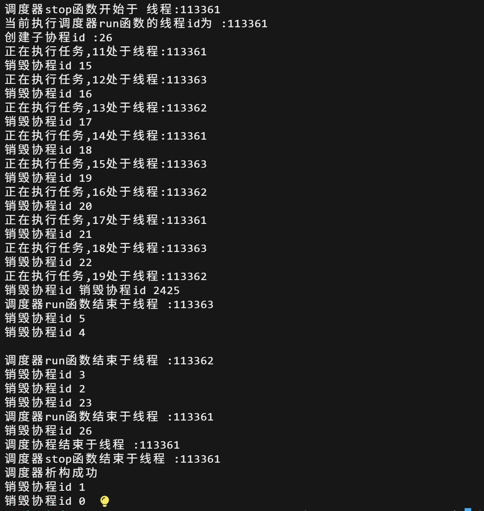