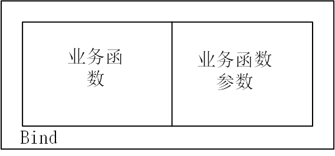
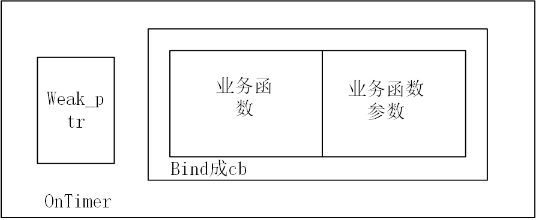
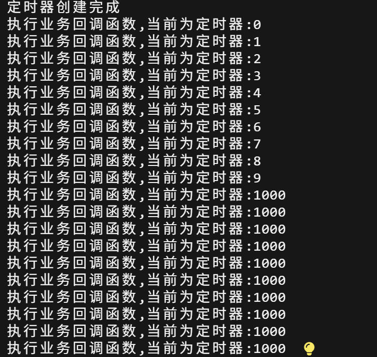

# 4Timer
实现了定时器(`Timer`)与定时器管理器(`TimerManager`)，用于管理限时任务，通过管理器可以管理存储在时间堆的定时器的删除，添加，刷新等功能
## 知识补充
### 工厂模式
工厂模式说起来听复杂，这里简短描述一下。对于工厂模式是为了将对象的创建与对象的使用逻辑分离出来，对于本节我们把`Timer`定时器当成产品，而`TimerManager`当成产品的使用和管理，即工厂类，一般来说工厂类应该是产品类的友元，这样就可以直接访问产品类的私有构造函数，而不暴露产品的构造函数接口给外部。分离产品的生产和使用也是降低耦合内聚的体现
### shared_mutex
`shared_mutex`也是线程锁`mutex`的一种，它主要是针对于读多写少的并发效率问题，比如有n个需要读取但完全不写入的线程访问同一片数据，因为不会对数据产生影响所以允许同时读取。shared_mutex的好处是当多个线程同时读时不会阻塞，仅当写入时会独占。
其中写锁的类型为`unique_lock`
`std::unique_lock<std::shared_mutex> write_lock(mutex);`
而读锁的类型为`shared_lock`
`std::shared_lock<std::shared_mutex> read_lock(mutex);`
工作原理为:
当线程加读锁时：
* 若当前无写锁，正常读取
* 若当前有写锁，等到写锁释放后再进行读取
当线程加写锁时：
* 当线程无读锁或者写锁时:进行加锁并实现写入
* 当线程有读锁或者写锁时:等待所有锁释放才进行写入
### chrono
`std::chrono`核心功能是「精准、类型安全地处理时间和时间间隔」,简单来说是处理时间相关的标准库

## timer.h
### 代码
定义了定时器类与定时器管理类，并且声明了其中的一些功能
```
#ifndef __SYLAR_TIMER_H__
#define __SYLAR_TIMER_H__

#include<memory>
#include<vector>
#include<set>
#include<shared_mutex>
#include<assert.h>
#include<functional>
#include<mutex>

namespace sylar{
//定时器管理类
class TimerManager;//先声明TimerManager类

//定时器类
//这个继承模板我们之前见过，作用是同步外部和内部的shared_ptr
class Timer : public std::enable_shared_from_this<Timer>
{

friend class TimerManager;//友元，可以允许TimerManager访问Timer的私有成员

public:
//从时间堆里面删除Timer定时器
bool cancel();
//刷新定时器的超时时间
bool refresh();
//重设定时器的超时时间
//传入新的超时时间，精确到毫秒，是否从当前时间替换
bool reset(uint64_t ms,bool from_now);

private:
//私有构造函数
//传入超时时间，超时触发的回调函数，是否触发循环，定时器管理器指针
Timer(uint64_t ms,std::function<void()> cb,bool recurring,TimerManager* manager);


private:
//是否触发循环
bool m_recurring =false;
//超时时间
uint64_t m_ms=0;
//绝对超时时间，定时器下一次触发的时间点
std::chrono::time_point<std::chrono::system_clock> m_next;
//超时触发的回调函数
std::function<void()> m_cb;
//该定时器所属定时管理器指针
TimerManager* m_manager =nullptr;

private:
//为最小堆实现的重载运算符
struct Comparator
{
    //函数声明
    //比较两操作数,在后面会比较两计时器的
bool operator()(const std::shared_ptr<Timer> &lhs,const std::shared_ptr<Timer> &rhs) const;
};

};

class TimerManager
{
friend class Timer;//声明定时器类为友元类

public:
//构造函数
TimerManager();
//虚析构函数
virtual ~TimerManager();

//创建定时器，这里实际上传入了管理器的指针this到定时器的构造函数中，这是工厂模式的特性
std::shared_ptr<Timer> addTimer(uint64_t ms,std::function<void()> cb,bool recurring =false);

//虽然weak_ptr在其他地方的作用是解决循环引用，这里实际上是避免回调函数访问对象已经被析构
//weak_ptr实际上是回调函数的参数
std::shared_ptr<Timer> addConditionTimer(uint64_t ms,std::function <void()> cb,std::weak_ptr<void> weak_cond,bool recurring=false);

//获取时间堆最近的一个定时器的超时时间
uint64_t getNextTimer();

//参数是回调函数的vector数组
//取出所有超时定时器的回调函数传入cbs中
void listExpiredCb(std::vector<std::function<void()>> &cbs);

//时间堆中是否存在有效定时器
bool hasTimer();

protected:
//当最早超时的定时器添加到时间堆堆顶时调用该函数
virtual void onTimerInsertedFront() {};

//添加定时器到时间堆，这里属于重载函数
void addTimer(std::shared_ptr<Timer> timer);

private:
//检测系统时钟是否回退
bool detectClockRollover();

private:
std::shared_mutex m_mutex;//共享读写锁
//使用set来模拟时间堆
std::set<std::shared_ptr<Timer>,Timer::Comparator> m_timers;
//在下一次getNextTimer()执行前，标记onTimerInsertedFront是否执行过
bool m_tickled=false;
//上次检查系统时间是否回退的绝对时间
std::chrono::time_point<std::chrono::system_clock> m_previouseTime;
};


}
#endif 
```

### 说明
需要区分的是三个看起来很类似的东西
1. `Timer(uint64_t ms,std::function<void()> cb,bool recurring,TimerManager* manager);`  
定时器的私有构造函数，只对定时器管理器暴露接口，真正实现构造定时器对象的功能
2. `std::shared_ptr<Timer> addTimer(uint64_t ms,std::function<void()> cb,bool recurring =false);  `
TimerManager类的成员函数，功能就是创建定时器
3.`void addTimer(std::shared_ptr<Timer> timer);  `
上面一个的重载函数，功能是添加定时器到时间堆

其次就是我们使用了set作为时间堆，对里面的定时器会自动排序，至于为什么不使用优先队列
是因为优先队列既不能使用迭代器访问所有元素，也不能修改内部元素，在比如查找一个定时器是否存在的功能时无法实现

## timer.cpp
具体实现定时器和定时器管理器的各种功能，包括对定时器的删除，添加，对超时定时器以及条件定时器的处理
### 代码
```
# include "timer.h"

namespace sylar{

    //取消定时器
bool Timer::cancel()
{
    //独占写入锁
std::unique_lock<std::shared_mutex> write_lock(m_manager->m_mutex);

//回调函数为空说明定时器已经失效
if(m_cb==nullptr)
{
    return false;
}
else{
    m_cb=nullptr;//置空回调函数
}

//在时间堆中获取对应定时器的迭代器
auto it=m_manager->m_timers.find(shared_from_this());


if(it!=m_manager->m_timers.end()){//找到时
    m_manager->m_timers.erase(it);//移除对应定时器
}
//实际上没有找到也会返回true,只要不是重复删除就行
return true;

}

//刷新定时器
bool Timer::refresh()
{

    std::unique_lock<std::shared_mutex> write_lock(m_manager->m_mutex);

    if(m_cb==nullptr)//定时器已经死掉了
    {
        return false;
    }


    auto it=m_manager->m_timers.find(shared_from_this());
    if(it==m_manager->m_timers.end())//没找到
    {
        return false;
    }

    m_manager->m_timers.erase(it);//先需要删除旧的定时器
    //新的绝对超时时间为当前系统时间+原本设定的超时时间
    m_next= std::chrono::system_clock::now() +std::chrono::milliseconds(m_ms);

    m_manager->m_timers.insert(shared_from_this());//重新加入

    return true;

}

//重设定时器，传入新的超时毫秒数以及是否从当前时间计算
bool Timer::reset(uint64_t ms,bool from_now)
{
    //重设时间和原时间相同且不需要从当前时间开始计算
    if(ms==m_ms && ! from_now)
    {
        return true;
    }


    { //用于加锁的作用域
        std::unique_lock<std::shared_mutex> write(m_manager->m_mutex);

        if(!m_cb)
        {
            return false;
        }

        auto it =m_manager->m_timers.find(shared_from_this());

        if(it==m_manager->m_timers.end()){
            return false;
        }
        m_manager->m_timers.erase(it);

    }

    //如果为真，起始时间会被设置为当前系统时间，若为假，起始时间应该为原开始时间(原绝对超时时间-原超时时间)
    auto start=from_now? std::chrono::system_clock::now() : m_next-std::chrono::milliseconds(m_ms);

    m_ms=ms;//更新超时时间

    m_next =start+std::chrono::milliseconds(m_ms);//更新绝对超时时间
    m_manager->addTimer(shared_from_this());
    return true;
}

//定时器构造函数
Timer::Timer(uint64_t ms,std::function<void()> cb,bool recurring,TimerManager* manager):
m_recurring(recurring),m_ms(ms),m_manager(manager),m_cb(cb)
{
    auto now =std::chrono::system_clock::now();//记录当前系统时间

    m_next=now+std::chrono::milliseconds(m_ms);

}

//重载运算符实现
bool Timer::Comparator::operator()(const std::shared_ptr<Timer> &lhs,const std::shared_ptr<Timer> &rhs) const
{
    assert(lhs!=nullptr && rhs!=nullptr);//保证定时器存在

    return lhs->m_next < rhs->m_next;//按照升序排列
}

//定时器管理类构造函数
TimerManager::TimerManager()
{
    //为检测时间是否回退detectClockRollover提供基准时间
    m_previouseTime =std::chrono::system_clock::now();
}

//析构函数空实现，这是因为时间堆存储的是智能指针的好处
TimerManager::~TimerManager()
{

}

//创建普通计时器
std::shared_ptr<Timer> TimerManager::addTimer(uint64_t ms,std::function<void()> cb,bool recurring)
{
    //创建计时器，返回智能指针
    std::shared_ptr<Timer> timer (new Timer(ms,cb,recurring,this));

    addTimer(timer);//虽然同名，但这里是重载函数，作用就是将定时器插入时间堆

    return timer;
}

//检验weak_ptr指向的需要检查的业务对象是否存活,这里的cb和定时器的m_cb并不是一个东西而是提前传入的原始回调函数
static void OnTimer(std::weak_ptr<void> weak_cond,std::function<void()> cb)
{
    //weak_ptr需要转化为shared_ptr才能正常使用   
    std::shared_ptr<void> tmp =weak_cond.lock();
    if(tmp)
    {
        cb();
    }

}

//创建附带条件的定时器，这里的weak_ptr是回调函数的参数，它的作用是指向需要检查是否存货的业务对象，类型是万能类型
std::shared_ptr<Timer> TimerManager::addConditionTimer(uint64_t ms,std::function<void()> cb,std::weak_ptr<void> weak_cond,bool recurring)
{

    //bind会将OnTimer封装成新的回调函数,weak_cond和cb是它的参数，再创建定时器
    return addTimer(ms,std::bind(&OnTimer,weak_cond,cb),recurring);

}

//获得时间堆中堆顶的时间计时器的剩余超时时间
uint64_t TimerManager::getNextTimer()
{
    //共享读锁
    std::shared_lock<std::shared_mutex> read_lock(m_mutex);
    m_tickled=false;//重置m_tickled标记

    if(m_timers.empty())
    {
        return ~0ull;//表示不存在定时器
    }

    auto now=std::chrono::system_clock::now();//当前系统时间
    auto time=(*m_timers.begin())->m_next;//获取时间堆堆顶的绝对超时时间,这里的解引用结果是定时器的智能指针

    if(now >=time)
    {
        return 0;//已经超时
    }
    else{
        //获取剩余时间的间隔
        auto duration =std::chrono::duration_cast<std::chrono::milliseconds>(time-now);
        return static_cast<uint64_t>(duration.count());//将间隔转换为秒数返回
    }


}

//获取时间堆中所有已经超时的定时器，并且存入cbs数组中
void TimerManager::listExpiredCb(std::vector<std::function<void()>> &cbs)
{

    //写共享锁
    std::unique_lock<std::shared_mutex> write_lock(m_mutex);

    auto now =std::chrono::system_clock::now();

    //检查时钟是否回滚
    bool rollover =detectClockRollover();

    //时间堆不为空，保证时钟没有回滚且堆顶定时器已超时
    //迭代器要解引用后才能获取智能指针
    while(!m_timers.empty() && (rollover || (*m_timers.begin())->m_next<=now))
    {

        std::shared_ptr<Timer> temp= *m_timers.begin();//获取堆顶定时器

        m_timers.erase(m_timers.begin());

        cbs.push_back(temp->m_cb);//加入堆顶定时器回调函数

        //处理循环定时器
        if(temp->m_recurring)
        {
            temp->m_next=now+std::chrono::milliseconds(temp->m_ms);

            m_timers.insert(temp);
        }
        else
        {
            temp->m_cb=nullptr;//非循环定时器清空回调函数
        }
    }
}

//判断时间堆是否为空
bool TimerManager::hasTimer()
{
    std::shared_lock<std::shared_mutex> read_lock(m_mutex);
    return !m_timers.empty();
}

//添加定时器到时间堆
void TimerManager::addTimer(std::shared_ptr<Timer> timer)
{
    bool at_front =false;//标记添加的定时器是否成为堆顶

    {
        std::unique_lock<std::shared_mutex> write_lock(m_mutex);//共享写锁
        auto it =m_timers.insert(timer).first;
        //判断新插入的定时器是否在定时器堆顶却未触发过onTimerInsertedFront()
        at_front=(it==m_timers.begin()) && !m_tickled;

        if(at_front)
        {
            m_tickled=true;
        }

    }
    if(at_front)
    {
        onTimerInsertedFront();//唤醒
    }

}

//检测系统时钟是否回退
bool TimerManager::detectClockRollover()
{
    bool rollover =false;
    auto now =std::chrono::system_clock::now();
    //如果当前时间比上次检查时间少一小时以上说明时钟回退
    if(now <(m_previouseTime- std::chrono::milliseconds(60*60*1000)))
    {
        rollover=true;
    }
    m_previouseTime =now;//更新基准时间
    return rollover;
}


}
```

### 疑问与回答

1. `onTimerInsertedFront`为什么没有实现？
这个是为后续的epoll模块预留的函数，当前类还用不到

2.关于回调函数的封装问题
我们通过bind函数来打包我们需要传入的回调函数cb，对于普通定时器和带条件的定时器有以下两种封装路径
对于普通定时器

对于带条件的定时器


3.为什么在条件定时器中与封装函数的`OnTimer`要使用weak_ptr?
我们应该先说明weak_ptr到底是在做什么？我们知道weak_ptr是一种智能指针，它可以解决shared_ptr的循环引用问题。但是在这里，它的功能是不引入对于shared_ptr管理内存的额外计数，且确保我的需要的对象是否存活。
带条件的定时器可以理解为，额，类似生鲜食品，虽然我们会在定时器结束时处理内部回调函数，但是如果我们的货没了，那根本就不能实现对应的回调函数。
总而言之，weak_ptr是为了确保业务对象的存活，同时不影响对于shared_ptr的计数

## test.cpp

```
#include "timer.h"
#include <unistd.h>
#include <iostream>
using namespace sylar;

void func(int i)
{
	std::cout << "i: " << i << std::endl;
}

int main(int argc, char const *argv[])
{
	std::shared_ptr<TimerManager> manager(new TimerManager());
	std::vector<std::function<void()>> cbs;

	// 测试listExpiredCb超时功能
	{
		for(int i=0;i<10;i++)
		{
			manager->addTimer((i+1)*1000, std::bind(&func, i), false);
		}
		std::cout << "all timers have been set up" << std::endl;

		sleep(5);
		manager->listExpiredCb(cbs);
		while(!cbs.empty())
		{
			std::function<void()> cb = *cbs.begin();
			cbs.erase(cbs.begin());
			cb();
		}

		sleep(5);
		manager->listExpiredCb(cbs);
		while(!cbs.empty())
		{
			std::function<void()> cb = *cbs.begin();
			cbs.erase(cbs.begin());
			cb();
		}			
	}
		
	// 测试recurring
	{
		manager->addTimer(1000, std::bind(&func, 1000), true);
		int j = 10;
		while(j-->0)
		{
			sleep(1);
			manager->listExpiredCb(cbs);
			std::function<void()> cb = *cbs.begin();
			cbs.erase(cbs.begin());
			cb();
			
		}		
	}
	return 0;
}
```

实现了对于非循环定时器和循环定时器的处理，这里的func就是业务函数，可以根据需要更改

## 输出结果
