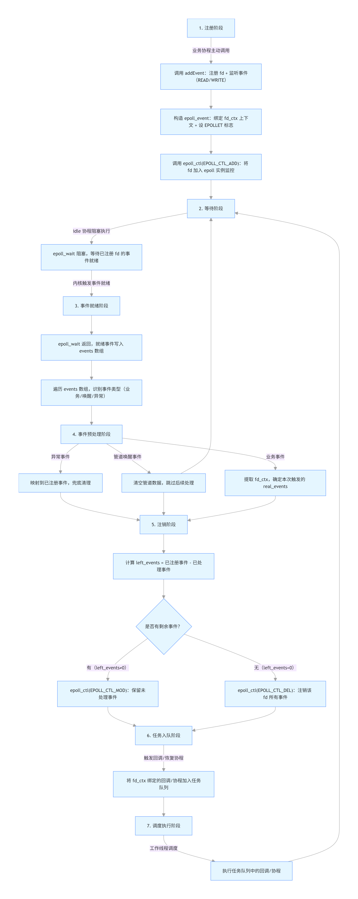
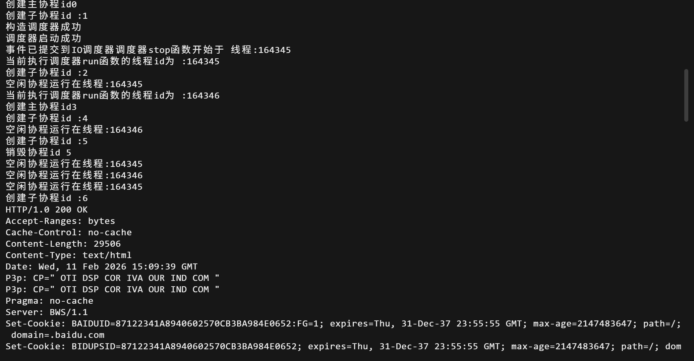
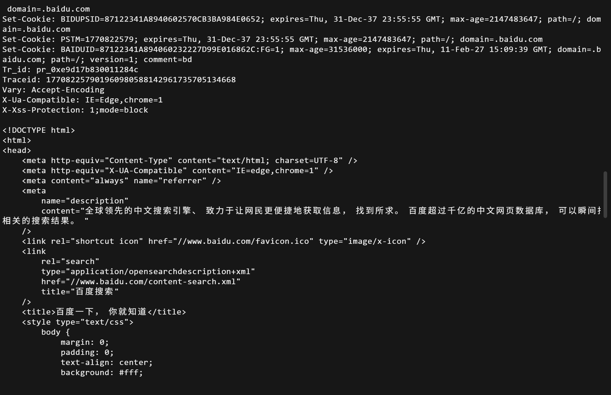
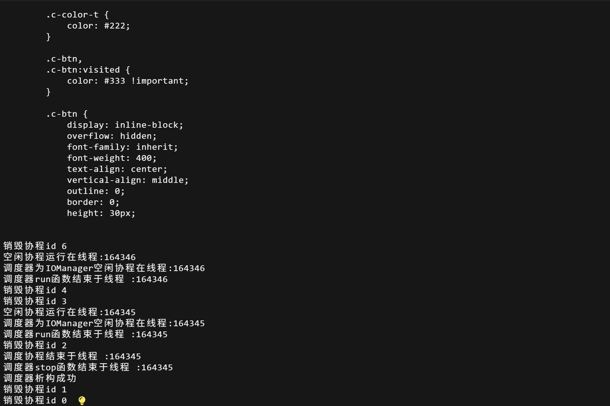

# 5iomanager
## 知识准备
本节最重要的知识是epoll，可以提前到下面的文档 epoll中了解
### iomanagerIO管理器和协程管理器的区别
首先IO管理器继承了协程管理器和定时器管理器类 (没错，C++可以继承多个父类)。它们的区别在于
协程管理器只能实现阻塞式IO（从数据就绪阶段到数据拷贝阶段一直阻塞）或者非阻塞式IO（主动轮询数据是否就绪），而IO管理器实现的是利用epoll实现IO多路复用，等有数据就绪时通知对应协程(这部分操作在idle函数中执行)。
并且，相比之下IO管理器可以通过注册IO事件，自动检测数据就绪情况，从而自动调度回调函数。而协程管理器只能手动添加任务到任务队列
并且继承了定时器任务，这是我们timer类实现的

## iomanager.h
### 代码
```
#ifndef _SYLAR_IOMANAGER_H_
#define _SYLAR_IOMANAGER_H_

#include "scheduler.h"
#include "timer.h"

namespace sylar{

class IOManager :public Scheduler,public TimerManager
{
public :
    //枚举宏定义事件，后续通过与或运算来更新与判断包含事件
    enum Event
    {
        NONE =0x0, //无事件
        READ =0x1, //读事件
        WRITE=0X4  //写事件
    };
private:
    //用于描述一个文件的上下文结构
    struct FdContext
    {
        //描述一个事件的上下文结构
        struct EventContext
        {
            Scheduler *scheduler =nullptr; //关联的调度器
            std::shared_ptr<Fiber> fiber;  //回调协程
            std::function<void()> cb; //回调函数
        };

        EventContext read;//读事件上下文
        EventContext write;//写事件上下文
        int fd=0;//事件关联的文件描述符(句柄)
        Event events =NONE;//当前注册事件，这是用户期望监控事件
        std::mutex mutex;

        EventContext& getEventContext(Event event);//获取上下文,返回值为引用
        void resetEventContext(EventContext &ctx); //重置事件上下文
        void triggerEvent(Event event); //触发对应事件

    };

public:

    //构造函数，传入工作线程数，是否把主线程当做工作线程，IOManger的名称
    IOManager(size_t threads =1,bool use_caller =true,const std::string &name="IOManager");
    ~IOManager();

    //给指定fd添加IO事件
    int addEvent(int fd,Event event,std::function<void()> cb=nullptr);

    //删除指定fd的指定事件，只注销不触发回调
    bool delEvent(int fd,Event event);

    //取消指定fd的指定事件，注销并触发回调
    bool cancelEvent(int fd,Event event);

    //取消fd中所有事件,触发全部事件的回调
    bool cancelAll(int fd);

    static IOManager* GetThis();//获取当前线程的IOManager实例指针
    

protected:
//还记得我们在scheduler未实现的唤醒函数吗
//重写scheduler类中的唤醒线程函数
void tickle() override;

//重写scheduler类中的停止判断函数
bool stopping() override; 

//重写scheduler类中的空闲线程工作函数
void idle() override;

//重写TimerManager的onTimerInsertedFront函数
//当定时器添加到时间堆顶时调用
void onTimerInsertedFront() override;

//调整fd上下文数组大小
void contextResize(size_t size);

private:
int m_epfd =0;//epoll的文件描述符(句柄)
int m_tickleFds[2];//用于线程间通信的管道描述符 0表示读 1表示写
std::atomic<size_t> m_pendingEventCount; //待处理的IO事件数
std::shared_mutex m_mutex;//读写锁
std::vector<FdContext *> m_fdContexts;//存储所有文件上下文结构数组，下标即为文件描述符


};


}

#endif
```
### 知识补充
#### 文件与文件上下文 事件与事件上下文 回调函数
在头文件中注意这个结构体
```
    //用于描述一个文件的上下文结构
    struct FdContext
    {
        //描述一个事件的上下文结构
        struct EventContext
        {
            Scheduler *scheduler =nullptr; //关联的调度器
            std::shared_ptr<Fiber> fiber;  //回调协程
            std::function<void()> cb; //回调函数
        };

        EventContext read;//读事件上下文
        EventContext write;//写事件上下文
        int fd=0;//事件关联的文件描述符(句柄)
        Event events =NONE;//当前注册事件，这是用户期望监控事件
        std::mutex mutex;

        EventContext& getEventContext(Event event);//获取上下文,返回值为引用
        void resetEventContext(EventContext &ctx); //重置事件上下文
        void triggerEvent(Event event); //触发对应事件

    };
```
1. 文件：linux中认为一切皆文件不只是我们认为的磁盘文件，可以被文件标识符标识的资源(socket/管道/普通文件/设备等)
2. 文件上下文(FdContext):是对一个文件的管理包，包含了读写事件上下文，监控事件，对事件的处理函数，以及同步锁  
文件上下文存储在m_fdContexts中，下标为fd，即文件描述符
3. 事件 ：对fd的IO状态变化，对应了epoll的`EPOLLIN/EPOLLOUT`,为枚举宏定义  
```
  enum Event
    {
        NONE =0x0, //无事件
        READ =0x1, //读事件
        WRITE=0X4  //写事件
    };
```
4. 事件上下文：某个事件触发后要执行的所在协程和对应回调函数（注意回调函数才是需要做的事情)
5. 回调函数：任务真正需要做的东西，当事件触发后要执行的具体逻辑函数，被包装在事件上下文中

#### 文件描述符与句柄
* 句柄是操作系统对外提供的通用资源标识，可以理解为c语言指针对内存的指示，句柄是资源的指针
* 文件描述符是linux下对于句柄的具体实现，使用非负整数表示(0/1/2/3...)


还有一些成员函数是我们在协程调度器scheduler和timer里面实现的，如果忘记请及时回去看看

## iomanager.cpp
目前来说代码量最多的cpp了，可能也会有点复杂，各位做好准备吧
### 代码

```
#include <unistd.h>
#include <sys/epoll.h>
#include<fcntl.h>
#include<cstring>

#include "ioscheduler.h"

static bool debug =true;

namespace sylar{

//获取当前线程的IOManager实例指针
IOManager* IOManager::GetThis()
{
    //将线程调度器中的实力指针强制转换为IOManager的实例指针，因为在获取实例指针时需要使用Scheduler的线程局部变量
    //dynamic_cast是安全的向下转型
    return dynamic_cast<IOManager*> (Scheduler::GetThis());
}

//获取指定事件对应的事件上下文
IOManager::FdContext::EventContext&  IOManager::FdContext::getEventContext(Event event)
{
    assert(event==READ ||event==WRITE);//我们只有读写事件
    switch(event)
    {
        case READ:
            return read;//读事件上下文
        case WRITE:
            return write;//写事件上下文

    }

    throw  std::invalid_argument("不支持的事件类型");

}

//重置事件上下文
void IOManager::FdContext::resetEventContext(EventContext &ctx)
{
    ctx.scheduler =nullptr; //清空关联的调度器
    ctx.fiber.reset();//释放协程
    ctx.cb=nullptr;//清空回调函数

}

//触发指定事件
void IOManager::FdContext::triggerEvent(IOManager::Event event){
    assert(events & event); //保证fd已注册该事件,按位与运算

    events =(Event)(events & ~event);//从此fd已经注册的时间中删除该事件

    EventContext& ctx =getEventContext(event);
    //如果你还记得的话，我们的协程调度器可以处理协程和回调函数两种类型
    if(ctx.cb)
    {
        ctx.scheduler->scheduleLock(&ctx.cb);//添加回调函数进入任务队列
    }
    else
    {
        ctx.scheduler->scheduleLock(&ctx.fiber);//添加协程进入任务队列
    }

    resetEventContext(ctx);//重置事件上下文
    return;

}

IOManager::IOManager(size_t threads,bool use_caller,const std::string &name):
Scheduler(threads,use_caller,name),TimerManager() //封装了线程调度器和定时器管理器
{
    m_epfd =epoll_create(5000); //创建epoll实例并获取epoll文件描述符,这里的参数毫无意义，大于0即可

    assert(m_epfd >0);//成功创建后会返回非负整数

    //rt是用来判断以下操作是否成功的返回值,0表示成功，否则返回错误码
    int  rt= pipe(m_tickleFds);//创建管道，实际上是我们的普通数组绑定为管道资源

    assert(!rt);

    //将管道监听注册到epoll上
    epoll_event event;
    event.events =EPOLLIN | EPOLLET;//EPOLLIN表示读事件，EPOLLET表示边缘触发
    event.data.fd =m_tickleFds[0]; //绑定管道读端,检测读端是否有数据

    rt =fcntl(m_tickleFds[0],F_SETFL,O_NONBLOCK); //将管道读端设置为非阻塞模式

    assert(!rt);

    rt=epoll_ctl(m_epfd,EPOLL_CTL_ADD,m_tickleFds[0],&event);
    assert(!rt);

    contextResize(32);//初始化fd上下文数组

    start();//启动调度器

}

//析构函数
IOManager::~IOManager(){

stop();//停止调度器
//关闭epoll句柄，管道读写端
close(m_epfd);
close(m_tickleFds[0]);
close(m_tickleFds[1]);

//释放所有fd上下文
for(size_t i=0;i< m_fdContexts.size();++i)
{
    if(m_fdContexts[i])
    {
        delete m_fdContexts[i];
    }
}

}

//调整fd上下文数组大小
void IOManager::contextResize(size_t size)
{
    m_fdContexts.resize(size);

    for(size_t i=0;i < m_fdContexts.size();++i)
    {
        if(m_fdContexts[i]==nullptr)//新扩容的地方
        {
            m_fdContexts[i]=new FdContext();
            m_fdContexts[i]->fd=i;//将文件描述符的编号赋给fd
        }
    }

}

//为指定的 fd 注册（添加）一个需要 epoll 监听的 IO 事件
int IOManager::addEvent(int fd,Event event,std::function<void()> cb)
{
    FdContext *fd_ctx=nullptr;//初始化文件上下文

    //共享读锁
    std::shared_lock<std::shared_mutex> read_lock(m_mutex);

    if((int)m_fdContexts.size() >fd) //当前fd要在数组范围内
    {
        fd_ctx=m_fdContexts[fd];
        read_lock.unlock();//获取上下文后释放锁
    }
    else
    {
        read_lock.unlock();//没找到也先释放锁

        std::unique_lock<std::shared_mutex> write_lock(m_mutex);//加写锁    
        contextResize(fd *1.5);//扩容到fd的1.5倍
        fd_ctx=m_fdContexts[fd];//获取fd的上下文
    }

    std::lock_guard <std::mutex> lock(fd_ctx->mutex);//加fd上下文互斥锁

    //检查该事件是否已经注册避免重复添加
    if(fd_ctx->events &event)
    {
        return -1;
    }

    //判断事件是否存在，存在则修改(mod),不存在则添加(add)
    int op=fd_ctx->events ? EPOLL_CTL_MOD : EPOLL_CTL_ADD;

    //epoll_event结构体，绑定该文件的上下文
    epoll_event epevent;
    epevent.events =EPOLLET |fd_ctx->events |event;
    epevent.data.ptr =fd_ctx;//监控对象为该文件的上下文

    //调用epoll_ctl添加或修改事件
    int rt=epoll_ctl(m_epfd,op,fd,&epevent);
    if(rt)
    {
        std::cerr <<"addEvent失败,调用epoll_ctl失败" << strerror(errno) <<std::endl;
        return -1;
    }

    ++m_pendingEventCount;//待处理IO事件数+1

    //使用或运算表示添加，使用与运算表示检查包含
    fd_ctx ->events =(Event)(fd_ctx->events |event);//更新fd上下文的已注册事件

    FdContext::EventContext& event_ctx =fd_ctx ->getEventContext(event);//更新事件上下文

    assert(!event_ctx.scheduler && !event_ctx.fiber && !event_ctx.cb);//保证事件上下文为初始状态，未被使用

    event_ctx.scheduler =Scheduler::GetThis();//绑定当前fd的调度器

    if(cb)//传入了回调函数
    {
        event_ctx.cb.swap(cb);//swap是为了避免拷贝
    }
    else
    {
        event_ctx.fiber =Fiber::GetThis();//获取当前执行的协程
        assert(event_ctx.fiber->getState() == Fiber::RUNNING);//只允许绑定运行状态的协程
    }

    return 0;

}

//删除fd的指定事件，删除但不触发
bool IOManager::delEvent(int fd,Event event)
{
    FdContext *fd_ctx=nullptr;//初始化文件上下文

    //共享读锁
    std::shared_lock<std::shared_mutex> read_lock(m_mutex);
    //在范围内查找fd上下文
    if((int)m_fdContexts.size() >fd)
    {
        fd_ctx=m_fdContexts[fd];
        read_lock.unlock();
    }
    else
    {
        read_lock.unlock();
        return false;//在数组中不存在这个文件
    }
    //fd上下文锁
    std::lock_guard<std::mutex> lock(fd_ctx->mutex);

    //检查是否包含对应事件
    if(!(fd_ctx->events & event))
    {
        return false;
    }

    Event new_events =(Event)(fd_ctx->events & ~event);//更新删除对应事件以后fd的事件
    //根据是否有剩余事件选择操作
    int op=new_events ? EPOLL_CTL_MOD : EPOLL_CTL_DEL;
    
    //修改epoll_event结构体的监听事件
    epoll_event epevent;
    epevent.events =EPOLLET | new_events;//边缘触发+剩余事件
    epevent.data.ptr =fd_ctx;

    int rt =epoll_ctl(m_epfd,op,fd,&epevent);
    if(rt)
    {
        std::cerr <<"delEvent失败,epoll_ctl失败" <<strerror(errno) <<std::endl;
        return -1;
    }

    --m_pendingEventCount;//待处理IO事件数-1

    fd_ctx->events= new_events;//更新fd上下文的事件
    
    //获取并重置事件上下文
    FdContext::EventContext& event_ctx =fd_ctx->getEventContext(event);
    fd_ctx->resetEventContext(event_ctx);
    return true;

}

//取消fd指定事件并触发回调
bool  IOManager::cancelEvent(int fd,Event event)
{
    FdContext *fd_ctx=nullptr;//初始化文件上下文

    //共享读锁
    std::shared_lock<std::shared_mutex> read_lock(m_mutex);
    //查找对应上下文
    if((int)m_fdContexts.size() >fd)
    {
        fd_ctx =m_fdContexts[fd];
        read_lock.unlock();
    }
    else
    {
        read_lock.unlock();
        return false;
    }

    std::lock_guard<std::mutex> lock(fd_ctx->mutex);

    //检查是否包含该事件
    if(!(fd_ctx->events & event))
    {
        return false;
    }

    Event new_events =(Event)(fd_ctx->events & ~event);//更新删除后的剩余事件
    int op =new_events ? EPOLL_CTL_MOD :EPOLL_CTL_DEL;//根据剩余事件为空还是还存在

    epoll_event epevent;
    epevent.events =EPOLLET | new_events;
    epevent.data.ptr =fd_ctx;

    int rt =epoll_ctl(m_epfd,op,fd,&epevent);//注销事件
    if(rt)
    {
        std::cerr <<"cancelEvent失败,epoll_ctl失败:" <<strerror(errno) <<std::endl;
        return -1;
    }

    --m_pendingEventCount;//待处理IO事件数-1

    fd_ctx->triggerEvent(event);//触发事件回调，这是和上一个函数唯一区别
    return true;

}

//取消fd的所有事件并触发回调
bool IOManager::cancelAll(int fd)
{
    //经典流程
    FdContext *fd_ctx =nullptr;
    std::shared_lock<std::shared_mutex> read_lock(m_mutex);
    if((int)m_fdContexts.size() >fd)
    {
        fd_ctx =m_fdContexts[fd];
        read_lock.unlock();
    }
    else
    {
        read_lock.unlock();
        return false;
    }

    std::lock_guard<std::mutex> lock(fd_ctx->mutex);

    //如果fd无事件就返回
    if(!fd_ctx->events)
    {
        return false;
    }

    int op=EPOLL_CTL_DEL;//因为要全部取消所以操作只有删除
    epoll_event epevent;
    epevent.events=0;
    epevent.data.ptr =fd_ctx;

    int rt=epoll_ctl(m_epfd,op,fd,&epevent);
    if(rt)
    {
        std::cerr <<"cancelAll失败,epoll_ctl失败:" <<strerror(errno) <<std::endl;
        return -1;
    }

    //如果有读事件
    if(fd_ctx->events & READ)
    {
        fd_ctx->triggerEvent(READ);//触发函数会把引用返回值，所以不用担心删除问题
        --m_pendingEventCount;
    }

    if(fd_ctx->events & WRITE)
    {
        fd_ctx->triggerEvent(WRITE);
        --m_pendingEventCount;
    }

    assert(fd_ctx->events==0);//当所有事件已经注销后
    return true;

}

//重写Scheduler::tickle,唤醒idle协程
void IOManager::tickle()
{
    if(!hasIdleThreads()) //没有空闲线程不需要唤醒
    {
        return;
    }
    //向管道写端写入1个字节即可唤醒线程切换到工作协程
    //写入什么字节都无所谓，只要写入字节到管道中就会结束epoll_wait
    int rt =write(m_tickleFds[1],"T",1); 
    assert(rt==1);
}

//重写Scheduler::stopping,判断IOManager是否可以停止
bool IOManager::stopping()
{
    uint64_t timeout =getNextTimer();//判断事件堆里面是否存在定时器，没有的情况会返回~0ull
    //需要满足无定时器，无待处理IO事件并且协程调度器停止标志
    return timeout==~0ull && m_pendingEventCount==0 && Scheduler::stopping();
}

//空闲函数
void IOManager::idle()
{
    static const uint64_t MAX_EVENTS =256; //最大事件数

    //创建epoll_event数组并使用智能指针管理
    std::unique_ptr<epoll_event[]> events(new epoll_event[MAX_EVENTS]);

    while(true) //进入死循环
    {
        if(debug) 
            std::cout <<"空闲协程运行在线程:" <<Thread::GetThreadId() <<std::endl;
        
        if(stopping()) //满足IO调度器停止条件时离开死循环
        {
            if(debug)
                std::cout <<"调度器为" <<getName() <<"空闲协程在线程:" <<Thread::GetThreadId() <<std::endl;
            break;
        }


        int rt =0;
        while(true)
        {
            static const uint64_t MAX_TIMEOUT =5000;//最大超时时间

            uint64_t next_timeout =getNextTimer();//下一个定时器的超时时间

            next_timeout =std::min(next_timeout,MAX_TIMEOUT);//取较小值

            //替换原本的休眠函数为阻塞等待事件，这里的get函数是为了获取events数组智能指针的原指针
            //rt表示本次调用实际获取到的就绪 IO 事件数量
            //epoll_wait会把接收到的就绪事件填入events中
            rt=epoll_wait(m_epfd,events.get(),MAX_EVENTS,(int)next_timeout);
            //EINTR指系统调用被信号中断，重试epoll_wait
            if(rt <0 && errno ==EINTR)
            {
                continue;
            }
            else//如果rt接收到事件(rt>0) 或者定时器超时(rt=0)都会结束
            {
                break;
            }
        }//while

        //在结束阻塞后先处理两种任务1.超时触发的任务2.新就绪IO的任务

        std::vector<std::function<void()>>  cbs;//回调函数数组
        listExpiredCb(cbs);//获取所有超时定时器回调并存储在cbs中
        //处理超时定时器事件
        if(!cbs.empty())
        {
            for(const auto&cb: cbs)
            {
                scheduleLock(cb);//加入任务
            }
            cbs.clear();
        }

        //处理就绪的IO事件
        for(int i=0;i< rt;++i)
        {
            epoll_event& event =events[i];//引用原数据避免拷贝

            //检查当前事件是否是由tickle唤醒的事件
            //因为tickle唤醒的事件对应的fd是m_tickleFds
            if(event.data.fd ==m_tickleFds[0])
            {
                uint8_t dummy[256];//临时缓冲区
                while(read(m_tickleFds[0],dummy,sizeof(dummy)) >0);
                continue;
            }

            //处理普通的IO事件
            FdContext *fd_ctx=(FdContext*)event.data.ptr;//取出关联fd的上下文
            std::lock_guard<std::mutex> lock(fd_ctx->mutex);

            //处理当前异常事件(错误或挂起)，转换为读写事件
            //注意这里因为文件已经是错误的，所以我们所做的并非是在执行，而是触发事件后赶紧让错误文件清理滚蛋
            if(event.events &(EPOLLERR | EPOLLHUP))
            {
                //按照文件期望监控事件包含的读写事件添加到event.events中
                event.events|= (EPOLLIN | EPOLLOUT) & fd_ctx->events;
            }

            //解析就绪的真正事件
            int real_events =NONE;
            if(event.events & EPOLLIN)
            {
                real_events|=READ;
            }

            if(event.events & EPOLLOUT)
            {
                real_events|=WRITE;
            }

            //无事件，或者说当前要做的事件没有一个是文件期望要做的事件
            if((fd_ctx->events & real_events)==NONE)
            {
                continue;
            }


            //计算剩余未触发的事件
            int left_events =(fd_ctx->events & ~real_events);

            int op=left_events?EPOLL_CTL_MOD:EPOLL_CTL_DEL;//确定操作是修改还是删除
            event.events =EPOLLET |left_events;//边缘触发

            int rt2 =epoll_ctl(m_epfd,op,fd_ctx->fd,&event);//修改event
            if(rt2)
            {
                std::cerr<< "空闲函数epoll_ctl失败" << strerror(errno) <<std::endl;
                continue;//错了就下一个
            }

            //处理对应事件
            if(real_events & READ)
            {
                fd_ctx->triggerEvent(READ);//注意这里的触发事件并不等于执行回调函数，只是将对应回调函数加入任务队列
                --m_pendingEventCount;
            }

            if(real_events & WRITE)
            {
                fd_ctx ->triggerEvent(WRITE);
                --m_pendingEventCount;
            }

            
        }//for循环结束
        
        //交出CPU执行权，切换到其他协程
        //实际上这里是我们原本线程调度器的升级版，看到这里应该理解了idle在做什么
        Fiber::GetThis() ->yield();

    }//while循环结束


  

}


//当定时器添加到堆顶时调用该函数
void IOManager::onTimerInsertedFront()
{
        //唤醒空闲协程，重新计算超时时间
        tickle();
}


}
```
### 知识补充
#### 什么是边缘触发，什么是水平触发
我们使用的都是边缘触发的模式，对比两种模式。
对于水平触发来说，数据就绪后，只要没处理完，每次epoll_wait都会触发。
而边缘触发只会在事件状态发生变化时才会通知一次，比如仅当数据从"未就绪->就绪"才会触发一次

虽然从结果这两者差不多，但是水平触发会导致更多的性能消耗，所以选取了边缘触发

#### pipe与m_tickleFds与epoll_event管道监听
各位注意到我们的管道数组m_tickleFds,实际上这真的是一个普通的数组。但是在构造函数里面，我们把使用了`pipe(m_tickleFds)`通过fd编号将其绑定（认证？）为内核态的管道资源。
就好像普通的本子真的只是纸做的，通过pipe给这个本子盖章内核就会认定其为官方的管道本子。

在后面我们会通过tickle中的write函数写入字节来达到唤醒的作用
并且通过epoll_event绑定了管道读端，我们的管道数组既可以被写入字节又可以被监控
```
//将管道监听注册到epoll上
    epoll_event event;
    event.events =EPOLLIN | EPOLLET;//EPOLLIN表示读事件，EPOLLET表示边缘触发
    event.data.fd =m_tickleFds[0]; //绑定管道读端,检测读端是否有数据
```

#### idle函数解析
我们的核心函数，看代码就知道很复杂，我尝试使用通俗的语言解释一下
我试图描述一下idle到底在干嘛，因为它实在太复杂了，首先我们有三个关键结构我们把最外层的死循环记为死循环1，内层的死循环记为死循环2，我所说这到底像什么玩意。首先我们要分清楚我们处理的任务，第一种是定时器任务型，这种任务到点了我们才处理，否则就放着不管，另一种是IO就绪型，直接输入到我们缓冲区的任务，检查都就需要立刻处理。
对于这样一家不人道的公司，他们的休假很“人性化”，做完事情就可以休假，休假请到idle度假协程酒店去，每一个线程员工分配一个专属空闲协程，在这里就可以摸鱼，进入就进入死循环1(说是死循环，实际上会被yield直接传送回办公室)，我们稍作准备将会就绪的IO事件集合events放在门口,然后就可以进入死循环2呼呼大睡了，到底睡多久呢？我们会根据最大超时时间和定时器最大时间的较小值设置闹钟，然后躺床上睡觉，不过要小心，ioscheduler老板随时会用tickle函数叫醒你，这意味着你要去上班了(判断epoll_wait的返回值，大于等于0就离开该循环)。离开死循环2后还在死循环1，不要着急上班，我们先把排班表写好（任务队列），我们首先将超时任务添加到任务队列，然后再看看我们的就绪IO事件集合events，将我们需要处理的普通IO事件解析处理，分清楚是读事件还是写事件，通过triggerEvent添加到任务队列中，好吧，我们会通过yield回到公司，idle度假酒店的当前记录会被保存，下一个依旧会再次进入死循环1.除了一种情况，公司倒闭了，如果判断stopping函数通过，说明公司炸了，老板跑路了，好了，idle度假酒店的死循环1结束，函数执行完成，除了主线程其他线程会被释放，这些员工也就回归内存老家了

##### events数组是什么，存放了什么？
` std::unique_ptr<epoll_event[]> events(new epoll_event[MAX_EVENTS]);`
实际上在创建时，这个数组虽然创建了很多epoll_event，但还是空的
在`epoll_wait(m_epfd,events.get(),MAX_EVENTS,(int)next_timeout);`中会把接收到的就绪事件按照顺序填入events
##### 如何理解if判断
`if(event.data.fd ==m_tickleFds[0])`因为我们的tickle函数也会写入字节，算作一次事件，但并没有回调函数也没必要执行后面的操作，所以这里要把写入的数据读取并消耗掉
所以有后面的
```
uint8_t dummy[256];//临时缓冲区
                while(read(m_tickleFds[0],dummy,sizeof(dummy)) >0);//将管道数组的数据消耗掉
                continue;
```

#### 执行的整体流程
我也担心自己没法说清楚，这是使用AI生成的流程图，没有任何问题的

值得一提的是，虽然我们把idle当做空闲协程，但是我们每一轮的定时器超时任务和新的IO事件都是在idle函数中处理的。也就是说当我们在工作协程时，我们并不会实时添加新的任务到任务队列，任务做完进入空闲协程执行idle函数，我们才把下一轮的任务再添加到任务队列中。这种延迟在高性能IO框架中是可以接受的，所以不用担心

## 测试案例
```
#include"ioscheduler.h"
#include<iostream>
#include<sys/socket.h>
#include<netinet/in.h>
#include<arpa/inet.h>
#include<fcntl.h>
#include<unistd.h>
#include<sys/epoll.h>
#include<cstring>
#include<cerrno>


using namespace sylar;

char recv_data[4096];//全局缓冲区

const char data[]="GET / HTTP/1.0\r\n\r\n";//这是最简请求报文，作用是请求根目录资源，也就会获取首页资源

int sock;//全局socket文件描述符

//回调函数，处理读事件
void func()
{
    recv(sock,recv_data,4096,0);//从sock中读取数据到recv_data缓冲区
    //打印接收到的recv_data
    std::cout <<recv_data << std::endl <<std::endl;
}

//处理写事件
void func2()
{
    send(sock,data,sizeof(data),0);

}

int main(int argc,char const *argv[])
{
    IOManager manager(2);//两个工作线程，其他默认

    //创建TCP socket
    //使用IPv4协议，TCP流式套接字，默认协议(TCP)
    sock =socket(AF_INET,SOCK_STREAM,0);

    //服务器地址结构体
    sockaddr_in server;
    server.sin_family =AF_INET; //地址族为IPv4
    server.sin_port=htons(80);//端口80
    server.sin_addr.s_addr=inet_addr("103.235.46.96"); //服务器IP地址，这是百度IP，因为百度对应http的请求相对宽松

    fcntl(sock,F_SETFL,O_NONBLOCK);//设置socket为非阻塞模式

    //发起非阻塞连接
    connect(sock,(struct sockaddr *)&server,sizeof(server));

    //向IO调度器注册事件
    manager.addEvent(sock,IOManager::WRITE,&func2);//注册写事件，绑定了回调函数func2
    manager.addEvent(sock,IOManager::READ,&func);//注册读事件，绑定了回调函数func

    std::cout <<"事件已提交到IO调度器";
    //这里虽然主函数结束了，但是IO调度器依旧在执行
    return 0;


}
```

忽略掉套接字部分，实际上也就是创建IO管理器和注册读写事件，我们的写事件是向百度申请首页信息，我也尝试过哔哩哔哩，不过被拒绝了＞﹏＜


## 输出结果




