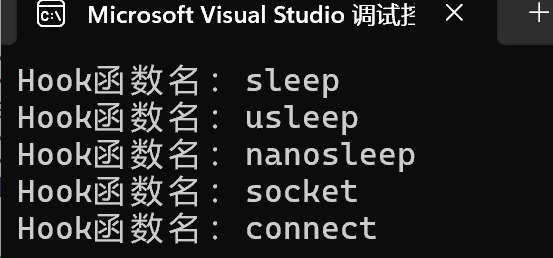

# hook
居然写到了最后一个模块，看起来我们的协程库终于到了终点
说起来钩子，各位会想到什么，我想起了海绵宝宝里面的一集

（或许在说明时我应该加点有趣的东西？）
## 前言
好吧，我们的hook并非要勾走什么人
* 劫持系统函数与hook
我们的对象就是你！系统函数！各位应该知道，比如我们自己传入的回调函数，我们可以自由设置yield，并自由恢复resume，这保证了我们在遇到数据未就绪或者其他阻塞时，我们可以及时挂起该协程，避免当前线程卡死在单一协程上。但是有一个问题，系统函数并不能这样操作，我们压根就不知道系统函数的内部构造也不支持这样的yield。这就是hook模块诞生的原因，也就是劫持/替换原始系统函数变成我们需要的支持协程与epoll事件触发的系统函数。


hook模块代码量真的不少，总之各位打起精神！
## hook.h
### 代码
```
#ifndef _HOOK_H_
#define _HOOK_H_

#include <unistd.h>
#include <sys/socket.h>
#include <sys/types.h>          
#include <sys/uio.h>
#include <sys/ioctl.h>
#include <fcntl.h>

namespace sylar{

bool is_hook_enable();
void set_hook_enable(bool flag);

}

extern "C"
{
	// track the original version
	typedef unsigned int (*sleep_fun) (unsigned int seconds);
	extern sleep_fun sleep_f;

	typedef int (*usleep_fun) (useconds_t usec);

	extern usleep_fun usleep_f;

	typedef int (*nanosleep_fun) (const struct timespec* req, struct timespec* rem);
	extern nanosleep_fun nanosleep_f;	

	typedef int (*socket_fun) (int domain, int type, int protocol);
	extern socket_fun socket_f;

	typedef int (*connect_fun) (int sockfd, const struct sockaddr *addr, socklen_t addrlen);
	extern connect_fun connect_f;

	typedef int (*accept_fun) (int sockfd, struct sockaddr *addr, socklen_t *addrlen);
	extern accept_fun accept_f;

	typedef ssize_t (*read_fun) (int fd, void *buf, size_t count);
	extern read_fun read_f;

	typedef ssize_t (*readv_fun)(int fd, const struct iovec *iov, int iovcnt);
	extern readv_fun readv_f;

	typedef ssize_t (*recv_fun) (int sockfd, void *buf, size_t len, int flags);
	extern recv_fun recv_f;

	typedef ssize_t (*recvfrom_fun) (int sockfd, void *buf, size_t len, int flags, struct sockaddr *src_addr, socklen_t *addrlen);
	extern recvfrom_fun recvfrom_f;

	typedef ssize_t (*recvmsg_fun) (int sockfd, struct msghdr *msg, int flags);
	extern recvmsg_fun recvmsg_f;

	typedef ssize_t (*write_fun) (int fd, const void *buf, size_t count);
	extern write_fun write_f;

	typedef ssize_t (*writev_fun) (int fd, const struct iovec *iov, int iovcnt);
	extern writev_fun writev_f;

	typedef ssize_t (*send_fun) (int sockfd, const void *buf, size_t len, int flags);
	extern send_fun send_f;

	typedef ssize_t (*sendto_fun) (int sockfd, const void *buf, size_t len, int flags, const struct sockaddr *dest_addr, socklen_t addrlen);
	extern sendto_fun sendto_f;

	typedef ssize_t (*sendmsg_fun) (int sockfd, const struct msghdr *msg, int flags);
	extern sendmsg_fun sendmsg_f;

	typedef int (*close_fun) (int fd);
	extern close_fun close_f;

	typedef int (*fcntl_fun) (int fd, int cmd, ... /* arg */ );
	extern fcntl_fun fcntl_f;

	typedef int (*ioctl_fun) (int fd, unsigned long request, ...);
	extern ioctl_fun ioctl_f;

	typedef int (*getsockopt_fun) (int sockfd, int level, int optname, void *optval, socklen_t *optlen);
    extern getsockopt_fun getsockopt_f;

    typedef int (*setsockopt_fun) (int sockfd, int level, int optname, const void *optval, socklen_t optlen);
    extern setsockopt_fun setsockopt_f;

    // function prototype -> 对应.h中已经存在 可以省略
	// sleep function 
	unsigned int sleep(unsigned int seconds);
	int usleep(useconds_t usce);
	int nanosleep(const struct timespec* req, struct timespec* rem);

	// socket funciton
	int socket(int domain, int type, int protocol);
	int connect(int sockfd, const struct sockaddr *addr, socklen_t addrlen);
	int accept(int sockfd, struct sockaddr *addr, socklen_t *addrlen);

	// read 
	ssize_t read(int fd, void *buf, size_t count);
	ssize_t readv(int fd, const struct iovec *iov, int iovcnt);

    ssize_t recv(int sockfd, void *buf, size_t len, int flags);
    ssize_t recvfrom(int sockfd, void *buf, size_t len, int flags, struct sockaddr *src_addr, socklen_t *addrlen);
    ssize_t recvmsg(int sockfd, struct msghdr *msg, int flags);

    // write
    ssize_t write(int fd, const void *buf, size_t count);
    ssize_t writev(int fd, const struct iovec *iov, int iovcnt);

    ssize_t send(int sockfd, const void *buf, size_t len, int flags);
    ssize_t sendto(int sockfd, const void *buf, size_t len, int flags, const struct sockaddr *dest_addr, socklen_t addrlen);
    ssize_t sendmsg(int sockfd, const struct msghdr *msg, int flags);

    // fd
    int close(int fd);

    // socket control
    int fcntl(int fd, int cmd, ... /* arg */ );
    int ioctl(int fd, unsigned long request, ...);

    int getsockopt(int sockfd, int level, int optname, void *optval, socklen_t *optlen);
    int setsockopt(int sockfd, int level, int optname, const void *optval, socklen_t optlen);
}
#endif
```
### 解析
#### 函数指针重命名
如果各位忘了函数指针和函数指针的重命名问题可以回去看看。
为什么要使用函数指针重命名？这是因为我们使用的是"外挂式"hook，这或许相当于游戏里面的打模组，装上hook后使用的是我们劫持后的系统函数，卸下hook后我们使用的是原始系统函数。我们要做的是**让用户做到不知道我们已经替换了系统函数**
```
typedef unsigned int (*sleep_fun) (unsigned int seconds);
	extern sleep_fun sleep_f;
```
比如这里我们把sleep的返回值和参数替换为了sleep_fun 并且构造了函数指针sleep_f 在hook.cpp中实现对sleep的宏定义替换
#### extern
这是让全局变量能够被其他外部文件使用的语法，其实全局变量本身就具有外部链接属性，只不过我们要加上这个关键字才能被其他文件识别

#### C++的名字修饰问题与extern "C"
因为我们的代码是使用C++  编写的，`extern "C"`是要求函数按照C语言编写。这是因为C++为了支持重载，会把函数名修饰。比如`void func(int)`编译为`_z4funci`这样我们就无法成功劫持系统函数了

## hook.cpp
代码量真的很多，如果遇到看不懂的，请耐心看完我们的解析，你一定还会有收获的
### 代码
```
#include "hook.h"
#include "ioscheduler.h"
#include <dlfcn.h>
#include <cstdarg>
#include "fd_manager.h"
#include <string.h>

//宏定义，XX为占位符
#define HOOK_FUN(XX)\
        XX(sleep)\
        XX(usleep)\
        XX(nanosleep)\
        XX(socket)\
        XX(connect)\
        XX(accept)\
        XX(read)\
        XX(readv)\
        XX(recv)\
        XX(recvfrom)\
        XX(recvmsg)\
        XX(write)\
        XX(writev)\
        XX(send)\
        XX(sendto)\
        XX(sendmsg)\
        XX(close)\
        XX(fcntl)\
        XX(ioctl)\
        XX(getsockopt)\
        XX(setsockopt)

namespace sylar
{

    static thread_local bool t_hook_enable =false;//线程局部变量，hook开启标记

    //获取hook开启状态
    bool is_hook_enable()
    {
        return t_hook_enable;
    }

    //设置hook开关
    void set_hook_enable(bool flag)
    {
        t_hook_enable =flag;
    }

    void hook_init()
    {
        static bool is_inited=false;//标记是否初始化，静态变量
        if(is_inited)
        {
            return ;
        }
    
    is_inited =true;

    //宏替换函数 dlsym的作用是查找系统原始函数
    //比较复杂可以到文档查看
    #define XX(name) name ## _f =(name ##_fun)dlsym(RTLD_NEXT,#name);
        HOOK_FUN(XX) //批量为之前定义的函数指针赋值
    #undef XX //释放宏定义


    }

    //全局初始化结构体
    struct HookIniter
    {
        HookIniter()
            {
                hook_init();
            }
    };

static HookIniter s_hook_initer;//静态初始化结构体实例


} //sylar

//定时器信息结构体
struct timer_info
{
    int cancelled =0;
};

//通用IO操作函数，使用模板，封装了读/写类型的逻辑
//args使用了完美转发，可以保留左值和右值特性,表示我们的其余参数
//OriginFun为原始函数类型，event为IO事件类型
template <typename OriginFun,typename... Args>
static ssize_t do_io(int fd,OriginFun fun,const char* hook_fun_name,uint32_t event,int timeout_so,Args&&... args)
{
    //需要开启hook
    if(!sylar::t_hook_enable)
    {
        return fun(fd,std::forward<Args>(args)...);
    }

    //获取fd上下文, FdMgr是FdManager的单例模式实例，我们在前面typedef了
    std::shared_ptr<sylar::FdCtx> ctx =sylar::FdMgr::GetInstance()->get(fd);
    if(!ctx)
    {
        return fun(fd,std::forward<Args>(args)...);
    }

    if(ctx->isClosed())
    {
        errno =EBADF;//EBADF表示无效的文件描述符
        return -1;
    }

    //非socket或者设置了非阻塞
    if(!ctx->isSocket() || ctx ->getUserNonblock())
    {
        return fun(fd,std::forward<Args>(args)...);
    }

    //获取fd超时时间
    uint64_t timeout =ctx->getTimeout(timeout_so);

    //构造定时器信息类实例
    std::shared_ptr<timer_info> tinfo(new timer_info);

//重试标签，当IO未就绪时，挂起协程重试，配合后面的goto
retry:

    //执行IO操作
    ssize_t n=fun(fd,std::forward<Args>(args)...);

    //处理信号中断错误，中断就重试
    while(n==-1 && errno==EINTR )
    {
        n=fun(fd,std::forward<Args>(args)...);
    }

    //EAGAIN表示资源暂时不可用,需要挂起
    if(n==-1 &&errno ==EAGAIN)
    {
        //获取IO调度器实例
        sylar::IOManager* iom=sylar::IOManager::GetThis();
        //构造定时器
        std::shared_ptr<sylar::Timer> timer;
        //这里的weak_ptr就是为了避免tinfo循环引用以及确认对象参数是否有效
        std::weak_ptr<timer_info> winfo(tinfo);

        //设置超时时间，当timeout为(uint64_t)-1时表示永久等待
        if(timeout !=(uint64_t)-1)
        {
            //可以回忆一下我们在timer的条件定时器函数，这里使用了lambda表达式[]里面的是捕获参数
            //请看清楚我们的函数在哪里结束
            timer =iom ->addConditionTimer(timeout,[winfo,fd,iom,event]()//这里传入了timeout,与回调函数
            //以下是lambda表达式内容
            {
                //检查tinfo是否有效
                auto t=winfo.lock();
                if(!t || t->cancelled)
                {
                    return ;
                }
                t->cancelled =ETIMEDOUT;//标记为超时

                iom->cancelEvent(fd,(sylar::IOManager::Event)(event));
            },winfo);//这里传入第三个参数，函数结束

        }   //if(timeout !=(uint64_t)-1)


            //添加IO事件
        int rt =iom->addEvent(fd,(sylar::IOManager::Event)(event));
        //添加事件失败，rt为-1
        if(rt)
        {
            std::cout <<hook_fun_name <<"addEvent(" <<fd <<","<< event <<")" <<std::endl;
            if(timer)
            {
                timer->cancel();//取消该定时器
            }
            return -1;
         }
         else //事件添加成功，挂起当前协程,讲CPU执行权交给其他协程，一边凉快去
         {
            sylar::Fiber::GetThis()->yield();
            
            //这里是再次执行时从时间堆里面取出计时器
            //再次执行有两种情况，获得了资源，或者计时器超时
            if(timer)
            {
                timer->cancel();
            }

            //检查是否超时
            if(tinfo->cancelled ==ETIMEDOUT)
            {
                errno =tinfo->cancelled; //获取错误码
                return -1;
            }
            goto retry;//跳转到retry标签
         }
    }  //if(n==-1 &&errno ==EAGAIN)

    return n; //到这里说明处理成功了

}

extern "C"{

    //宏定义
#define XX(name) name ## _fun name ## _f=nullptr;
    HOOK_FUN(XX)
#undef XX

//睡眠函数
unsigned int sleep(unsigned int seconds)
{
    //未开启hook使用原始sleep
    if(!sylar::t_hook_enable)
    {
        return sleep_f(seconds);
    }
    //获得当前协程对象
    std::shared_ptr <sylar::Fiber> fiber=sylar::Fiber::GetThis();
    sylar::IOManager* iom=sylar::IOManager::GetThis();

    //将睡眠函数替换为定时器，等待secons秒后将协程再加入任务队列
    iom->addTimer(seconds*1000,[fiber,iom](){iom->scheduleLock(fiber,-1);});

    fiber->yield();//睡了就别在占着地
    return 0;
}

//和前面一样，这里是微秒级睡眠
int usleep(useconds_t usec)
{
    if(!sylar::t_hook_enable)
    {
        return usleep_f(usec);
    }

    std::shared_ptr<sylar::Fiber> fiber =sylar::Fiber::GetThis();
    sylar::IOManager* iom=sylar::IOManager::GetThis();
    iom->addTimer(usec/1000,[fiber,iom](){iom->scheduleLock(fiber,-1);});
    fiber->yield();
    return 0;
}

//纳秒级休眠
int nanosleep(const struct timespec* req,struct timespec* rem)
{
    if(!sylar::t_hook_enable)
    {
        return nanosleep_f(req,rem);
    }

    //超时时间等于秒转毫秒+纳秒转毫秒
    int timeout_ms =req->tv_sec*1000+req->tv_nsec/1000/1000;

    std::shared_ptr<sylar::Fiber> fiber =sylar::Fiber::GetThis();
    sylar::IOManager* iom=sylar::IOManager::GetThis();
    iom->addTimer(timeout_ms,[fiber,iom](){iom->scheduleLock(fiber,-1);});
    fiber->yield();
    return 0;
}

//socket函数，创建sock并初始化上下文
int socket(int domain,int type,int protocol)
{
    if(!sylar::t_hook_enable)
    {
        return socket_f(domain,type,protocol);
    }

    int fd=socket_f(domain,type,protocol);
    if(fd==-1)
    {
        std::cerr <<"socket()失败:" <<strerror(errno) <<std::endl;
        return fd; 
    }

    //auto_create为true时自动创建fd上下文
    sylar::FdMgr::GetInstance()->get(fd,true);
    return fd;

}

//
int connect_with_timeout(int fd,const struct sockaddr* addr,socklen_t addrlen,uint64_t timeout_ms)
{
    if(!sylar::t_hook_enable)
    {
        return connect_f(fd,addr,addrlen);
    }

    //获取fd上下文，这里就不能自动创建了
    std::shared_ptr<sylar::FdCtx> ctx =sylar::FdMgr::GetInstance()->get(fd);
    if(!ctx ||ctx ->isClosed())
    {
        errno=EBADF;//fd上下文无效
        return -1;
    }

    //不是socket按照原始函数处理
    if(!ctx->isSocket())
    {
        return connect_f(fd,addr,addrlen);
    }
    //非阻塞模式按照原始函数处理
    if(ctx->getUserNonblock())
    {
        return connect_f(fd,addr,addrlen);
    }

    int n=connect_f(fd,addr,addrlen);
    //EINPROGRESS表示连接中
    if(n==0) //连接成功
    {
        return 0;
    }
    else if(n!=-1 || errno!=EINPROGRESS) //连接失败
    {
        return  n;
    }

    //剩下的情况是连接中
    //你知道的，我们肯定不会在这里傻等，所以设置事件+添加超时定时器
    sylar::IOManager* iom=sylar::IOManager::GetThis();
    std::shared_ptr<sylar::Timer> timer;
    std::shared_ptr<timer_info> tinfo(new timer_info);
    std::weak_ptr<timer_info> winfo(tinfo);

    //和do_io一样的逻辑
    if(timeout_ms !=(uint64_t)-1)
    {
        timer =iom->addConditionTimer(timeout_ms,[winfo,fd,iom]()
        {
            auto t=winfo.lock();
            if(!t || t->cancelled)
            {
                return;
            }
            t->cancelled =ETIMEDOUT;//标记超时
            iom->cancelEvent(fd,sylar::IOManager::WRITE);//别忘记这里是取消事件并触发回调
        },winfo);
    }

    int rt=iom ->addEvent(fd,sylar::IOManager::WRITE);//添加写事件
    if(rt==0)
    {
        sylar::Fiber::GetThis()->yield();//挂起协程

        //恢复协程后取消定时器
        if(timer)
        {
            timer->cancel();
        }

        //说明是超时触发的协程恢复
        if(tinfo->cancelled)
        {
            errno=tinfo->cancelled;
            return -1;
        }
    }
    else    //添加失败
    {
        if(timer)
        {
            timer->cancel();
        }
        std::cerr <<"connect addEvent" <<fd <<",WRITE 事件错误";
    }
    //检查连接结果
    int error =0;
    socklen_t len=sizeof(int);
    if(getsockopt(fd,SOL_SOCKET,SO_ERROR,&error,&len)==-1)
    {
        return -1;
    }
    if(!error) //连接成功
    {
        return 0;
    }
    else
    {
        errno =error;
        return -1;
    }
}

//connect超时时间
static uint64_t s_connect_timeout =1;

//connect函数调用connect_with_timeout函数
int connect(int sockfd,const struct sockaddr*addr,socklen_t addrlen)
{
    return connect_with_timeout(sockfd,addr,addrlen,s_connect_timeout);
}


int accept(int sockfd,struct sockaddr *addr,socklen_t *addrlen)
{
    //通用IO模板，等待READ事件
    int fd=do_io(sockfd,accept_f,"accept",sylar::IOManager::READ,SO_RCVTIMEO,addr,addrlen);

    //连接成功，初始化fd上下文
    if(fd >=0)
    {
        sylar::FdMgr::GetInstance()->get(fd,true);
    }
    return fd;
}

//一样的写法，都是劫持系统函数并调用通用模板
ssize_t read(int fd,void *buf,size_t count)
{
    return do_io(fd,read_f,"read",sylar::IOManager::READ,SO_RCVTIMEO,buf,count);
}

ssize_t readv(int fd,const struct iovec *iov,int iovcnt)
{
   return do_io(fd, readv_f, "readv", sylar::IOManager::READ, SO_RCVTIMEO, iov, iovcnt);
}

ssize_t recv(int sockfd, void *buf, size_t len, int flags)
{
	return do_io(sockfd, recv_f, "recv", sylar::IOManager::READ, SO_RCVTIMEO, buf, len, flags);	
}

ssize_t recvfrom(int sockfd,void *buf,size_t len,int flags,struct sockaddr *src_addr,socklen_t *addrlen)
{
    return do_io(sockfd,recvfrom_f,"recvfrom",sylar::IOManager::READ,SO_RCVTIMEO,buf,len,flags,src_addr,addrlen);
}

ssize_t recvmsg(int sockfd,struct msghdr *msg,int flags)
{
    return do_io(sockfd,recvmsg_f,"recvmsg",sylar::IOManager::READ,SO_RCVTIMEO,msg,flags);
}

ssize_t write(int fd,const void *buf,size_t count)
{
    return do_io(fd,write_f,"write",sylar::IOManager::WRITE,SO_SNDTIMEO,buf,count);
}

ssize_t writev(int fd,const struct iovec *iov,int iovcnt)
{
    return do_io(fd,writev_f,"writev",sylar::IOManager::WRITE,SO_SNDTIMEO,iov,iovcnt);
}

ssize_t send(int sockfd,const void *buf,size_t len,int flags)
{
    return do_io(sockfd,send_f,"send",sylar::IOManager::WRITE,SO_SNDTIMEO,buf,len,flags);
}

ssize_t sendto(int sockfd,const void *buf,size_t len,int flags,const struct sockaddr *dest_addr, socklen_t addrlen)
{
    return do_io(sockfd,sendto_f,"sendto",sylar::IOManager::WRITE,SO_SNDTIMEO,buf,len,flags,dest_addr, addrlen);	
}

ssize_t sendmsg(int sockfd,const struct msghdr *msg,int flags)
{
    return do_io(sockfd,sendmsg_f,"sendmsg",sylar::IOManager::WRITE,SO_SNDTIMEO,msg,flags);
}

//关闭fd前，清理IO事件和上下文
int close(int fd)
{
    if(!sylar::t_hook_enable)
    {
        return close_f(fd);
    }

    //获取文件上下文
    std::shared_ptr<sylar::FdCtx> ctx=sylar::FdMgr::GetInstance()->get(fd);

    if(ctx)
    {
        auto iom=sylar::IOManager::GetThis();
        if(iom)
        {
            iom->cancelAll(fd);//取消并触发所有事件
        }
        sylar::FdMgr::GetInstance()->del(fd);
    }
    return close_f(fd);//再调用系统函数关闭fd
}

//文件控制函数
int fcntl(int fd,int cmd,...)
{
    va_list va;//可变参数列表

    va_start(va,cmd);//初始化可变参数列表，接受cmd后的参数
    switch(cmd)
    {
        case F_SETFL: //设置文件状态标志
        {
            int arg= va_arg(va,int);//获取int型可变参数
            va_end(va);

            std::shared_ptr<sylar::FdCtx> ctx=sylar::FdMgr::GetInstance()->get(fd);
            //不存在/已关闭/非套接字
            if(!ctx ||ctx->isClosed() || !ctx->isSocket())
            {
                return fcntl_f(fd,cmd,arg);
            }

            ctx->setUserNonblock(arg & O_NONBLOCK);//记录非阻塞标记,别忘了位运算
            if(ctx->getSysNonblock()) //用户说什么就是什么，系统不对就改系统的
            {
                arg|=O_NONBLOCK;//添加
            }
            else
            {
                arg &=~O_NONBLOCK;//移除
            }
            return fcntl_f(fd,cmd,arg);
        }
        break;
        //获取文件状态标志，注意区分系统和用户
        case F_GETFL:
        {
            va_end(va);
            int arg=fcntl_f(fd,cmd);//调用原始函数获取系统层标志
            std::shared_ptr<sylar::FdCtx> ctx=sylar::FdMgr::GetInstance()->get(fd);

            if(!ctx ||ctx->isClosed() || !ctx->isSocket())
            {
                return arg;
            }

            if(ctx->getUserNonblock())
            {
                return arg |O_NONBLOCK;//添加
            }
            else
            {
                return arg &~ O_NONBLOCK;//移除
            }
        }
        break;

        //下面这些是无其他参数的cmd
        case F_GETFD:
        case F_GETOWN:
        case F_GETLEASE:
#ifdef F_GETPIPE_SZ //这是跨平台兼容
        case F_GETPIPE_SZ:
#endif
        {
            va_end(va);//清理va
            return fcntl_f(fd,cmd);
        }
        break;

        //处理结构体参数
        case F_GETOWN_EX:
        case F_SETOWN_EX:
        {
            struct f_owner_exlock* arg =va_arg(va,struct f_owner_exlock*);
            va_end(va);
            return fcntl_f(fd,cmd,arg);
        }
        break;

        default://其他情况直接调用原始函数即可
            va_end(va);
            return fcntl_f(fd,cmd);
    }
}

//设备控制接口函数
int ioctl(int fd,unsigned long request,...)
{
    va_list va;
    va_start(va,request);
    void* arg=va_arg(va,void*);
    va_end(va);


    if(request ==FIONBIO)//如果命令是设置非阻塞模式
    {
        bool user_nonblock =!!*(int*)arg;//将整型数值转化为bool类型的安全写法
        std::shared_ptr<sylar::FdCtx> ctx =sylar::FdMgr::GetInstance()->get(fd);
        if(!ctx || ctx->isClosed() || !ctx->isSocket())
        {
            return ioctl_f(fd,request,arg);//直接调用原始函数
        }

        ctx->setUserNonblock(user_nonblock);//设置用户非阻塞标志
    }
    return ioctl_f(fd,request,arg);
}

//获取套接字选项值,直接使用原始函数
int getsockopt(int sockfd,int level,int optname,void *optval,socklen_t *optlen)
{
    return getsockopt_f(sockfd,level,optname,optval,optlen);
}

//设置套接字的选项，仅仅是获取一下超时信息
int setsockopt(int sockfd,int level,int optname,const void *optval,socklen_t optlen)
{
    if(!sylar::t_hook_enable)
    {
        return setsockopt_f(sockfd,level,optname,optval,optlen);
    }
    //处理SOL_SOCKET层的超时选项，就获取上下文的超时信息
    if(level == SOL_SOCKET)
    {
        //如果选项值是接收超时或者发送超时
        if(optname== SO_RCVTIMEO || optname==SO_SNDTIMEO)
        {
            std::shared_ptr<sylar::FdCtx> ctx =sylar::FdMgr::GetInstance()->get(sockfd);
            if(ctx)
            {
                const timeval *v=(const timeval*)optval;//转换为timeval结构体

                ctx->setTimeout(optname,v->tv_sec *1000+v->tv_usec/1000);//转换为毫秒
            }
        }
    }
    return setsockopt_f(sockfd,level,optname,optval,optlen);
}


} //extern "C"

```

### 解析
#### 宏定义与dlysm
这部分可能有点复杂，我们使用一个例子来说明
```
#include <iostream>
using namespace std;

// HOOK_FUN宏参数列表，XX是占位符，表示把接下来的括号的参数都替换为XX
#define HOOK_FUN(XX) \
    XX(sleep) \
    XX(usleep) \
    XX(nanosleep) \
    XX(socket) \
    XX(connect)

// 接着将后面的打印逻辑替换为print(name)
// #name 是字符串化，比如把name转换成"sleep"这种字符串
#define print(name) cout << "Hook函数名：" << #name << endl;

int main() {
    //这里可能有点反逻辑，实际上print(name)是函数，而上面的参数列表，会打印所有的XX替换的东西
    HOOK_FUN(print);
    return 0;
}

// 4. 用完释放宏，避免污染
#undef print
```
各位可以在自己编译器上试试，它的运行结果是  


也就是说HOOK_FUN替换了参数，而print(name) 替换了打印函数

回到我们这里
```
#define HOOK_FUN(XX)\
        XX(sleep)\
        XX(usleep)\
        XX(nanosleep)\
        XX(socket)\
        XX(connect)\
        XX(accept)\
        XX(read)\
        XX(readv)\
        XX(recv)\
        XX(recvfrom)\
        XX(recvmsg)\
        XX(write)\
        XX(writev)\
        XX(send)\
        XX(sendto)\
        XX(sendmsg)\
        XX(close)\
        XX(fcntl)\
        XX(ioctl)\
        XX(getsockopt)\
        XX(setsockopt)
```

XX替换了以上参数


```
    #define XX(name) name ## _f =(name ##_fun)dlsym(RTLD_NEXT,#name);
        HOOK_FUN(XX) //批量为之前定义的函数指针赋值
    #undef XX //释放宏定义
```

别着急，这里的细节很多，让我为大家细细解释
首先这里的XX也是占位符，但和上面一个不同，这里替换的是函数名。当调用HOOK_FUN(XX)时，我们拿`sleep`作为HOOK_FUN的其中一个参数来说明
1. name ->sleep 所以`XX(name)`替换为了`sleep ## _f=(sleep_fun)dlsym(RTLD_NEXT,#name)`
2. `name ## _f` ->`sleep_f` "##"表示拼接
3. `name ## _fun`->`sleep ## _fun`,同上
4. `#name` ->`"sleep"` #表示字符串化

`dlsym`比如`dlsym(RTLD_NEXT,"sleep")`
表示在系统动态库中查找名为"sleep"的函数的内存地址(也就是函数指针的值)
`RTLD_NEXT`表示跳过当前程序自定义的sleep函数，查找下一个也就是我们的系统原始sleep函数

具体可以了解[动态库加载函数dlsym 在C/C++编程中的使用](https://blog.csdn.net/xuedaon/article/details/123401531)

这样可能好理解了，这里的`HOOK_FUN(XX)`表示为比如sleep_f赋给sleep()的内存地址
是挺复杂的，我确实不能保证自己能将明白，无法理解的话我表示抱歉
#### 完美转发
完美转发也就是将函数模板接受到的参数，按照原始传入的类型（左值右值）转发给另一个函数，其间没有任何额外的拷贝与转换
各位如果理解了左值右值可能会更好理解这个
#include <cstdio>
#include <iostream>
#include <utility>

using namespace std;
// 左值传参
int add(int& x) {
    x++;
    cout <<"左值传参：" << x << endl;
    return x;
}

// 右值传参
int add(int&& x) {
    x++;
    cout <<"右值传参：" << x << endl;
    return x;
}

// 完美转发模板
template<typename T>
int perfect_forward_add(T&& x) { //万能引用
    return add(forward<T>(x));//还原为原始类别
}

int main() {
    int n = 1;
    perfect_forward_add(n);     //传入了左值
    cout << "n现在的值是" << n << endl;
    perfect_forward_add(10);    //传入了右值
    
    return 0;
}

#### do_io到底在做什么？
这里我会讲很长一段，各位端好板凳耐心听完吧
do_io是通用IO操作函数，例如accept,read,send等需要读写的函数都会通过这个函数模板。那do_io到底在做什么呢？现下结论，为每一个符合条件但数据未就绪的socket添加IO触发事件并添加超时定时器放置长时间等待。
我试图将其分为两个模块
第一个模块为判断模块，如果满足以下条件就按照对应的逻辑处理不需要添加事件和定时器
1. 不开启hook，执行系统原始函数
2. 无上下文，执行系统原始函数
3. 文件关闭，输出表示无效的文件描述符EBADF，返回-1
4. 非socket或非阻塞，执行系统原始函数

如果不满足以上条件进入下一个模块，事件定时器添加模块
我们先准备一下定时器信息类实例，然后进入后面的`retry-goto`循环，在循环中我们会反复试探是否能够成功处理，如果资源不可用，说明数据未就绪，我们添加定时器，这个定时器表明我们最多能接受这个socket一直不发数据多久。各位可能有这样的经历，当你打开一个网页放置一段时间不管，下一次点进入就要重新加载，这也和定时器原理类似。
并且会添加IO触发事件，回调是我们的当前协程，然后挂起协程，直到下一次数据就绪或者定时器超时都会恢复协程，如果是定时器超时直接返回-1，以后也不再管这个socket了，如果是数据就绪引发的恢复协程，我们循环retry-goto在尝试调用系统原始函数处理，然后再经历这样的循环直到socket不发数据导致定时器超时

好吧，也不算长，思考怎么去理解怎么去解释这段函数花了我不少时间，如果能帮助到大家就好
#### 阻塞模式和非阻塞模式 再次理解IO多路复用和阻塞/非阻塞IO
各位可能在上面看到很多对是否为阻塞模式的判断，是的，这是在区分是阻塞模式还是非阻塞模式。虽然我们在前置准备中认识到它，但是在实际操作中认识会更为深刻
* 阻塞模式：当数据未就绪时，阻塞当前线程/协程，直到数据就绪为止，鉴定为死脑筋
* 非阻塞模式：当数据未就绪时，离开返回错误（EAGAIN/EWOULDBLOCK）,不继续等待
而我们使用了linux的epoll进行IO多路复用，这几乎强绑定了使用非阻塞模式，但是如果是返回EAGAIN(资源不可用)，我们可以暂时挂起该协程直到IO事件触发再进行检验
所以如果用户设置的阻塞模式，也就没有我们后面什么事了

#### errno
errno是C/C++里系统自带的线程局部变量，也就是在线程中全局且唯一

对于errno有两种赋值场景
* 当系统调用失败后会自动赋值
* 手动赋值
这里常见的错误码比如EINTR(信号中断)或者EAGAIN（资源不可用）
注意请不要直接根据errno的内容来进行判断，因为这是线程局部变量，你判断的errno可能来自更早更无关的系统调用
正确的写法应该是if(n==-1&&errno==...)    
#### fcntl函数
fcntl函数我们之前已经见过了，一个用于操作文件描述符的系统函数，比如设置文件描述符状态锁定文件等
经过hook的fnctl在处理对应操作时会进行一些自定义操作，比如根据非阻塞模式修改参数等，并且对于原始系统函数fcntl保持
总的来说就是增加了一些额外的处理
        
#### 可变参数
具体可以学习[VA_LIST可变参数列表的使用方法与原理](https://blog.csdn.net/Erice_s/article/details/101811535)
总之我直接照抄别人的解释
|  函数   | 解释    |
| --- | --- |
| va_arg    |访问下一个可变参数函数参数     |
|va_end     | 结束可变参数函数参数的遍历    |
|va_list     |制作可变参数列表，保留va_start,va_arg,va_end,va_copy    |
| va_start    |允许访问可变参数函数参数     |

以fcntl里面的F_SETFL举例
首先我们设置
` va_list va`作为可变参数列表，用来接收上面的可变参数函数参数(就是...)
` va_start(va,cmd)`初始化可变参数列表，表示接收cmd后面的参数
`va_arg(va,int)`获取va中的下一个int型可变参数
`va_end(va)`结束可变参数列表

因为我们的F_SETFL是接收int型参数并处理的，所以接收int型即可


## 这些字段是什么意思？
最后的最后让我们来看看这些宏定义的字段到底是什么意思吧
* EBADF：无效的文件描述符
* EINTR：系统调用被信号中断
* EAGAIN：资源暂时不可用
* ETIMEDOUT：连接超时
* EINPROGRESS：操作正在进行中
* RTLD_NEXT：dlsym 函数的参数，代表 “在当前库之后的下一个库中查找符号”。
* SOL_SOCKET：socket 选项的 “级别” 参数，代表要设置的是 socket 层的选项（而非 IP/TCP 层）
* SO_ERROR：获取 socket 上的待处理错误。
* SO_RCVTIMEO：设置 socket 接收数据的超时时间
* SO_SNDTIMEO：设置 socket 发送数据的超时时间
* O_NONBLOCK：文件状态标志，代表 “非阻塞模式”
* F_SETFL：fcntl 的操作命令，代表 “设置文件状态标志”
* F_GETFL：fcntl 的操作命令，代表 “获取文件状态标志”
* F_GETFD：fcntl 的操作命令，代表 “获取文件描述符标志”
* F_GETTOWN：fcntl 的操作命令，代表 “获取接收 SIGIO/SIGURG 信号的进程 / 线程 ID”
* F_GETLEASE：fcntl 的操作命令，代表 “获取文件租约”
* F_GETPIPE_SZ：fcntl 的操作命令，代表 “获取管道（pipe）的大小”
* F_GETOWN_EX：fcntl 的操作命令，扩展版 F_GETTOWN，支持获取 “进程 ID / 线程 ID / 进程组 ID” 等详细属主信息
* F_SETOWN_EX：fcntl 的操作命令，扩展版 F_SETOWN，设置 fd 的信号属主（支持指定进程 / 线程）
* FIONBIO：ioctl 的命令码，用于设置 / 获取 fd 的非阻塞模式


    
长呼一口气，居然写到这里了，各位也居然看到这里，这说明我们协程库所有知识已经学习完成，不可思议吧，准备做这个项目的时候我也没想到能走这么远。不过不要掉以轻心，来做最后的性能测试吧