# 性能测试
## 测试准备
我们的压力测试使用ApacheBench
Debian/Ubuntu:`sudo apt-get install apache2-utils`
CentOS/RHEL:`sudo yum install httpd-tools`

安装好后使用`ab -V`检查：
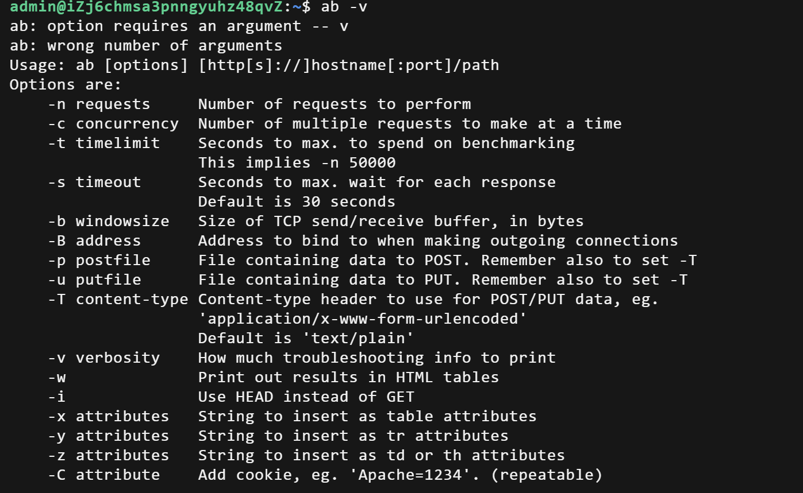
安装好后再进行下面的测试

## 协程库hook
以下系统函数都是hook后的函数，可以实现对数据未就绪socket的挂起
```
#include "ioscheduler.h"
#include "hook.h"
#include <unistd.h>
#include <sys/types.h>
#include <sys/socket.h>
#include <arpa/inet.h>
#include <fcntl.h>
#include <iostream>
#include <stack>
#include <cstring>
#include <chrono>
#include <thread>

//全局变量，监听套接字文件描述符
static int sock_listen_fd =-1;

//处理客户端连接事件
void test_accept();

//错误处理函数
void error(const char *msg)
{
    perror(msg); //打印系统错误信息
    printf("error...\n");
    exit(1);//退出程序
}

//监听IO读事件
void watch_io_read()
{
    sylar::IOManager::GetThis()->addEvent(sock_listen_fd,sylar::IOManager::READ,test_accept);
}

//处理客户端连接事件
void test_accept()
{
    //客户端地址结构体
    struct sockaddr_in addr;
    memset(&addr,0,sizeof(addr));//初始化地址结构体为0

    socklen_t len =sizeof(addr);

    //这里的accept已经是hook后的accept了
    int fd =accept(sock_listen_fd,(struct sockaddr*)&addr,&len);

    //accept失败
    if(fd <0)
    {
        std::cout <<"accept 失败,fd=" <<fd <<",errno =" <<errno <<std::endl;
    }
    else
    {
        std::cout <<"接收到连接,fd =" <<fd <<std::endl;

        //设置客户端fd为非阻塞模式
        fcntl(fd,F_SETFL,O_NONBLOCK);

        //为客户端fd添加READ事件,回调函数为lambda表达式
        sylar::IOManager::GetThis()->addEvent(fd,sylar::IOManager::READ,[fd]()
        {
            char buffer[1024];//接收缓冲区
            memset(buffer,0,sizeof(buffer));

            //循环读取客户端数据
            while(true)
            {
                //接收客户端数据，0是flags
                int ret =recv(fd,buffer,sizeof(buffer),0);

                if(ret >0)
                {
                    std::cout <<"接收到信息,fd=" <<fd<<",data=" <<buffer <<std::endl;
                    
                    //HTTP成功响应状态码，返回Nice try!
                    const char *response ="HTTP/1.1 200 OK\r\n"
                                           "Content-Type: text/plain\r\n"    
                                           "Content-Length: 10\r\n"          //表示9字节
                                           "Connection: keep-alive\r\n"      
                                           "\r\n"                            
                                           "Nice  try!";                  
                

                //发送HTTP响应
                ret=send(fd,response,strlen(response),0);

                close(fd);
                break;
                }

                 //读取数据失败或连接关闭
                if(ret <=0)
                  {   
                //客户端关闭或发送非EAGAIN(资源暂时不可用)错误
                if(ret ==0 || errno!=EAGAIN)
                {
                   std::cout <<"关闭连接,fd=" <<fd <<std::endl;
                   close(fd);
                   break;
                }
                else if(errno==EAGAIN)//资源暂时不可用
                {
                    //别着急，协程会自己挂起
                    std::cout <<"资源暂时不可用,fd=" <<fd <<std::endl;
                    // std:::this_thread::sleep_for(std::chrono::milliseconds(50));//延迟休眠时间，避免繁忙等待
                }
            }
            }//while(true) 循环读取
    });//addEvent lambda
    }//else 成功连接
    //触发事件后重新再手动添加，因为我们每次会移除事件并触发回调函数
    sylar::IOManager::GetThis()->addEvent(sock_listen_fd,sylar::IOManager::READ,test_accept);
}


//IO调度器测试函数
void test_iomanager()
{
    int portno =8080;//服务器监听端口
    struct sockaddr_in server_addr,client_addr;//服务器和客户端地址
    socklen_t client_len =sizeof(client_addr);//客户端地址长度

    //创建TCP套接字，传入IPv4，TCP协议，默认协议
    //hook后的socket会自动创建fd上下文
    sock_listen_fd =socket(AF_INET,SOCK_STREAM,0);

    if(sock_listen_fd <0)
    {
        error("失败创建socket..\n");
    }

    //解决"address already in use"错误，设置端口复用
    int yes =1;
    setsockopt(sock_listen_fd,SOL_SOCKET,SO_REUSEADDR,&yes,sizeof(yes));

    //初始化服务器地址结构体
    memset((char*)&server_addr,0,sizeof(server_addr));
    server_addr.sin_family =AF_INET;//地址族IPv4
    server_addr.sin_port =htons(portno);//端口号
    server_addr.sin_addr.s_addr = INADDR_ANY;//绑定所有网卡IP

    //绑定套接字并监听连接,这里并非绑定回调的std::bind
    if(bind(sock_listen_fd,(struct sockaddr *)&server_addr,sizeof(server_addr)) <0)
        error("绑定套接字错误...\n");

        //监听连接
    if(listen(sock_listen_fd,1024) <0)
    {
        error("监听连接错误...\n");
    }

    printf("epoll echo server listening for connections on port :%d\n",portno);

    fcntl(sock_listen_fd,F_SETFL,O_NONBLOCK);//设置监听fd为非阻塞模式

    sylar::IOManager iom(2);// 2个工作线程，这是因为我的服务器有点垃圾，各位可以根据自己的服务器决定最佳线程数

    //有客户端连接时触发test_accept回调
    iom.addEvent(sock_listen_fd,sylar::IOManager::READ,test_accept);
}

int main(int argc,char *argv[])
{
    test_iomanager();
    return 0;
}

```
这是我的服务器IP地址
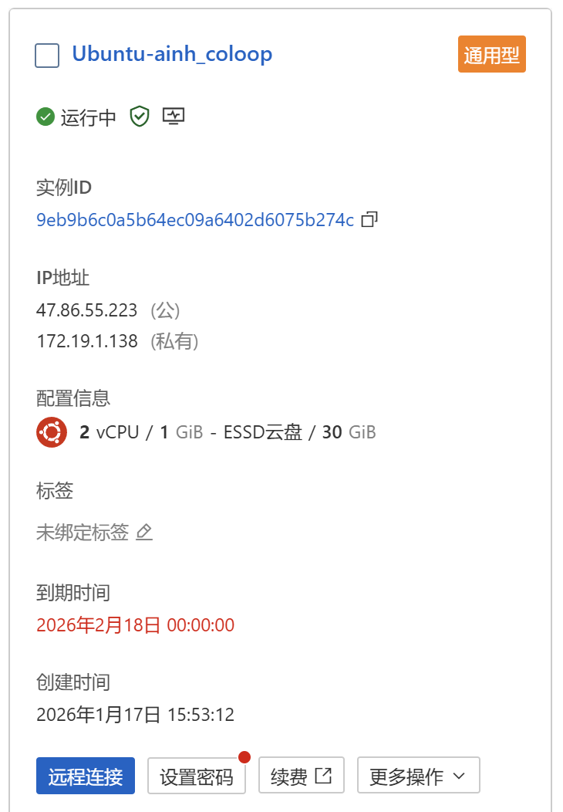
在运行期间用浏览器访问这个网址就可以看到`http://47.86.55.223:8080/`
注意这我的服务器网站，如果各位在本机上测试就应该是127.0.0.1:8080
### 简单测试


Nice try!不错的尝试

不过我建议大家在进行压测时关闭debug，不如你会看到你的服务器写爆了各种debug打印
### 高并发测试
`ab -n 1000 -c 100 http://47.86.55.223:8080/`
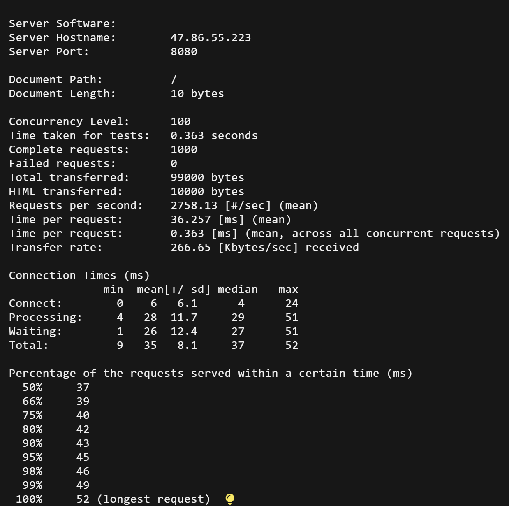
### 持续压力测试
直接向服务器申请一万次访问
`ab -n 10000 -c 500 http://47.86.55.223:8080/`
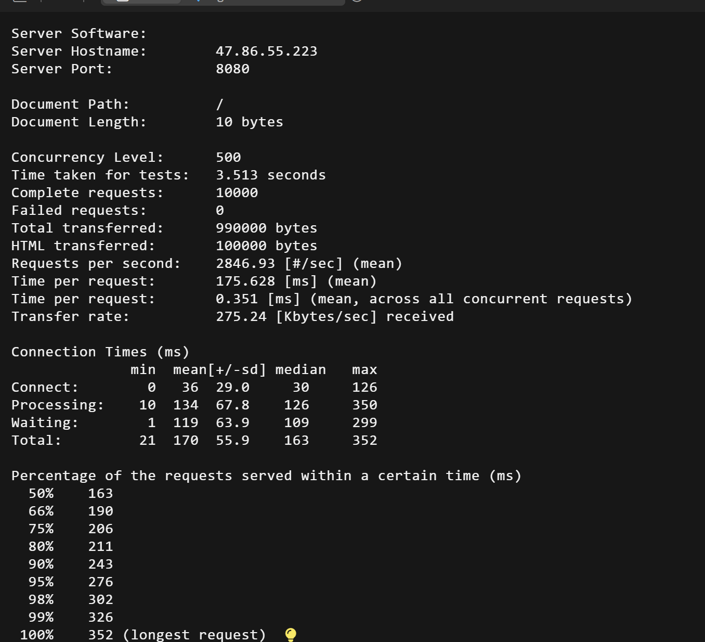
## 原生epoll
以下函数都是未hook的系统原始函数，仅仅使用了原生epoll实现
```
#include <stdio.h>
#include <stdlib.h>
#include <string.h>
#include <unistd.h>
#include <sys/socket.h>
#include <arpa/inet.h>
#include <sys/epoll.h>

#define MAX_EVENTS 10 
#define PORT 8080

//因为不在一个文件夹，以下函数均为系统原始函数，非hook后的函数
int main()
{
    //分别是监听socket，客户端socket,epoll实例的文件描述符，与在epoll_wait中返回的就绪事件数
    int listen_fd,conn_fd,epoll_fd,event_count;

    struct sockaddr_in server_addr,client_addr; //地址结构体
    socklen_t addr_len =sizeof(client_addr); 

    struct epoll_event events[MAX_EVENTS],event;//epoll_event数组和epoll_event实例

    if((listen_fd =socket(AF_INET,SOCK_STREAM,0)) ==-1)
    {
        perror ("socket");//系统错误打印函数
        return -1;
    }

    int yes =1;
    setsockopt(listen_fd,SOL_SOCKET,SO_REUSEADDR,&yes,sizeof(yes));


    //初始化服务器结构体
    memset(&server_addr,0,sizeof(server_addr));
    server_addr.sin_family=AF_INET; //IPv4
    server_addr.sin_port =htons(PORT); //端口8080
    server_addr.sin_addr.s_addr =INADDR_ANY; //绑定所有网卡

    //绑定监听socket到指定端口
    if(bind(listen_fd,(struct sockaddr*)&server_addr,sizeof(server_addr))==-1)
    {
        perror("bind");
        return  -1;
    }

    //监听连接
    if(listen(listen_fd,1024) ==-1)
    {
        perror("listen");
        return -1;
    }

    //创建epoll实例，epoll_creat1为epoll_create的增强版，0表示默认配置
    if((epoll_fd =epoll_create1(0))==-1)
    {
        perror("epoll_create1");
        return -1;
    }

    //设置epoll_event
    event.events =EPOLLIN;//监听事件为读事件
    event.data.fd =listen_fd;//关联监听套接字

    //将epoll_event添加到epoll
    if(epoll_ctl(epoll_fd,EPOLL_CTL_ADD,listen_fd,&event)==-1)
    {
        perror("epoll_ctl");
        return -1;
    }

    //核心逻辑
    while(true)
    {
        //等待有就绪事件发生，是不是和我们的idle函数那边很像？
        event_count =epoll_wait(epoll_fd,events,MAX_EVENTS,-1);

        if(event_count ==-1)
        {
            perror("epoll_wait");
            return -1;
        }

        //遍历找出所有就绪事件
        for(int i=0;i<event_count;i++)
        {   
            //如果这个位置是连接事件，就添加监听数据的事件
            if(events[i].data.fd ==listen_fd)
            {
                conn_fd =accept(listen_fd,(struct sockaddr*)&client_addr,&addr_len);
                if(conn_fd ==-1)
                {
                    perror("accept");
                    continue; //当前错误连接，接着处理下一个事件
                }

                event.events =EPOLLIN; //读事件
                event.data.fd =conn_fd;//监听客户端
                if(epoll_ctl(epoll_fd,EPOLL_CTL_ADD,conn_fd,&event) ==-1)
                {
                    perror("epoll_ctl");
                    return -1;
                }
            }
            else //读数据事件
            {
                char buf[1024];
                //读取客户端数据
                int len =read(events[i].data.fd,buf,sizeof(buf)-1);
                
                //读取失败或者客户端关闭连接
                if(len <=0)
                {
                    close(events[i].data.fd);
                }
                else //读取到数据
                {
                    //HTTP响应，打出GG
                    const char *response ="HTTP/1.1 200 OK\r\n"
                                          "Content-Type: text/plain\r\n"
                                          "Content-Length:10\r\n"
                                          "Connection: keep-alive\r\n"
                                          "\r\n"
                                          "Good Game!";

                    write(events[i].data.fd,response,strlen(response));

                    close(events[i].data.fd);
                }
            }
        }
    }
    close(listen_fd);
    close(epoll_fd);
    return 0;
}
```

值得一提的是原生epoll并不能实现多线程也没有协程等待，这是epoll的固有问题
### 简单测试
访问同样的网站即可`http://47.86.55.223:8080/`
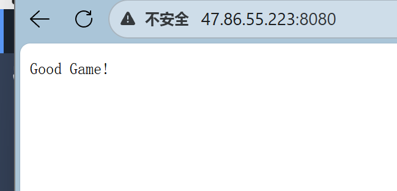
Good Game！
### 高并发测试
`ab -n 1000 -c 100 http://47.86.55.223:8080/`
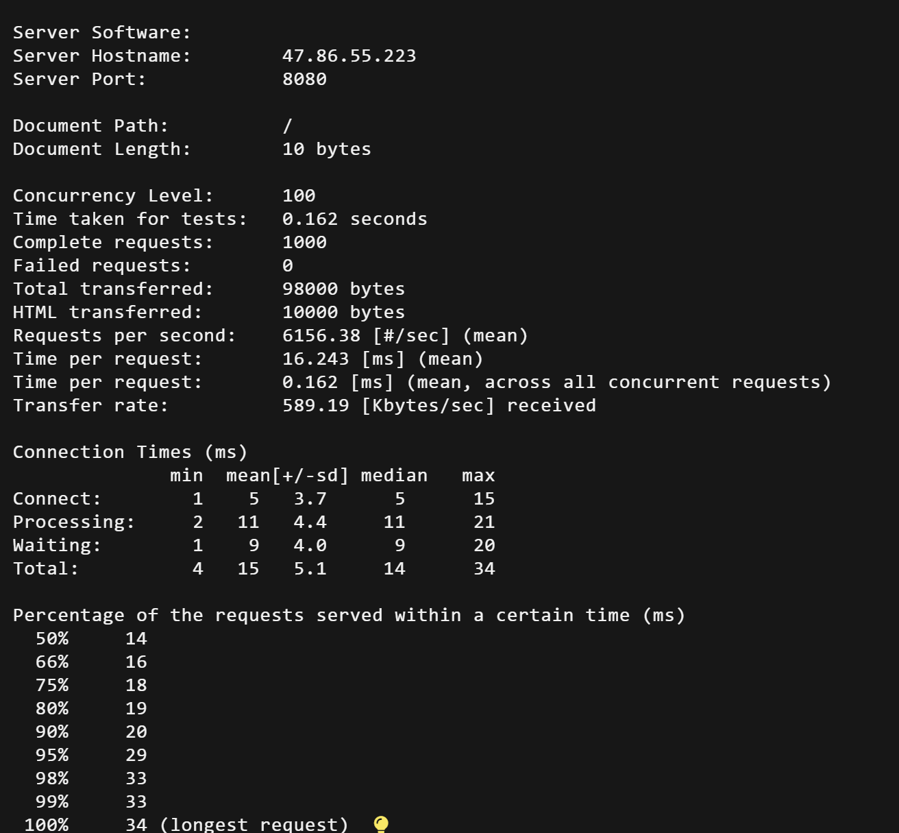
### 持续压力测试
`ab -n 10000 -c 500 http://47.86.55.223:8080/`
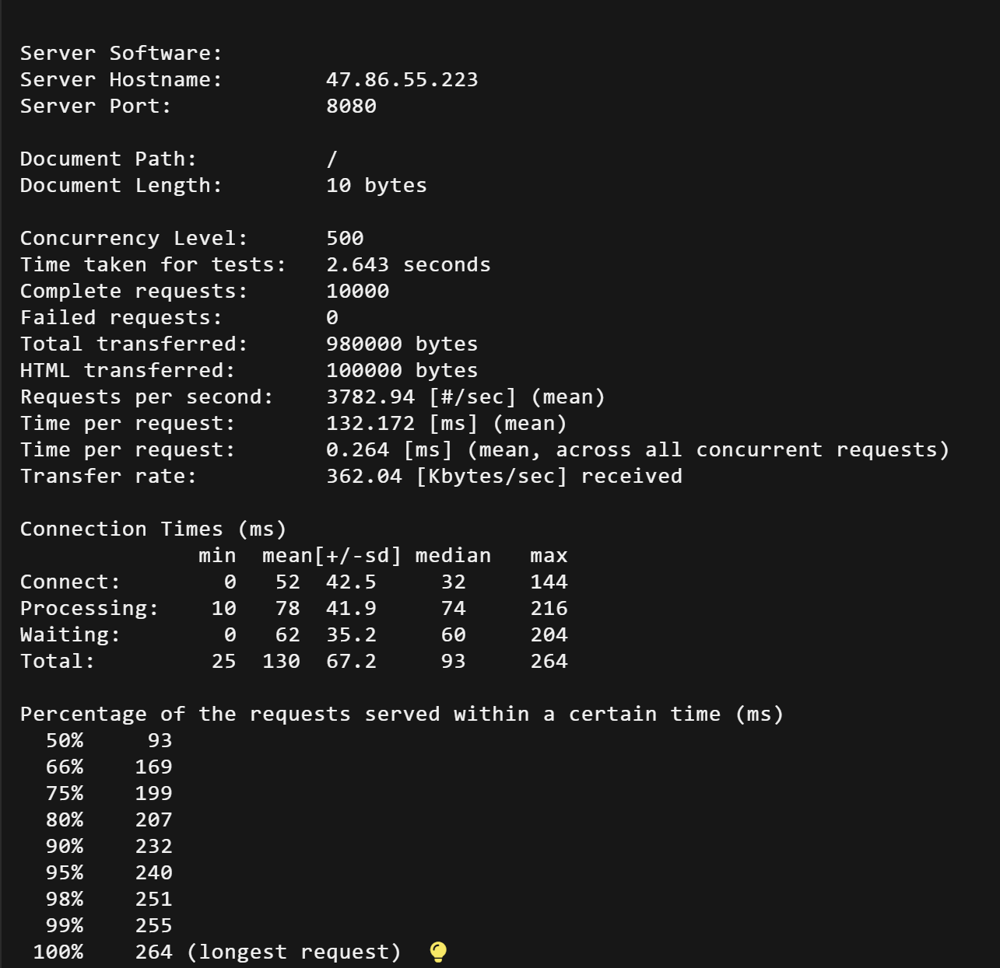


一般我们会比较两者的Requests per second（吞吐率）大小来比价性能，可以看到我们的协程库被epoll打爆了😭
因为作者的服务器是几十块钱便宜租的，压根就没有多余的物理核，这种情况多线程反而会成为负担，并且我们只是发送了简单的网络请求，这种情况，我们的协程库实际上没有任何优势


## 添加阻塞逻辑
请注意，作者并不知道这样的测试案例是否正确，因为我不会写测试！
我的思路是因为网络请求过于简单，不会有阻塞发生，那这样我们的协程库肯定比不过epoll。诶，没有阻塞我创造阻塞不就行了
对于协程库我们添加了系统原始函数` usleep_f(1000);`
并且在epoll里面添加了`usleep(1000);`
分别在以下位置
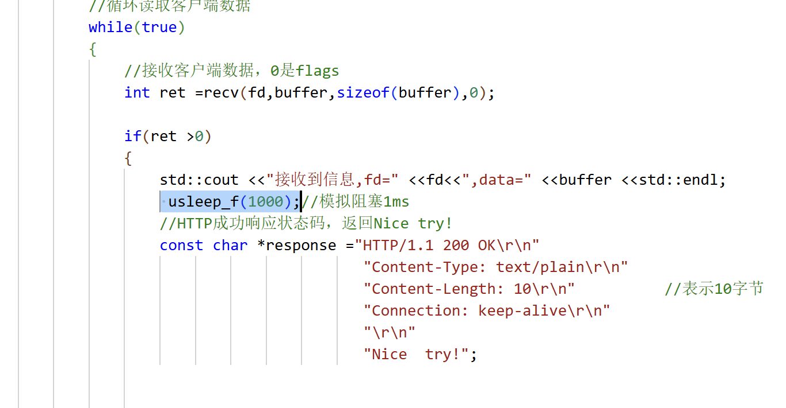


来看看差别吧
### 协程库：
   * 高并发测试  
    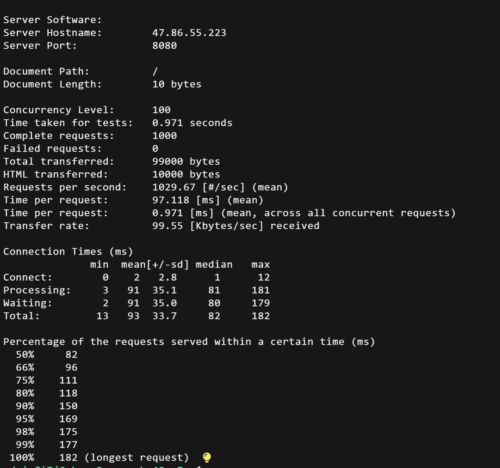
   * 模拟持续压力测试  
    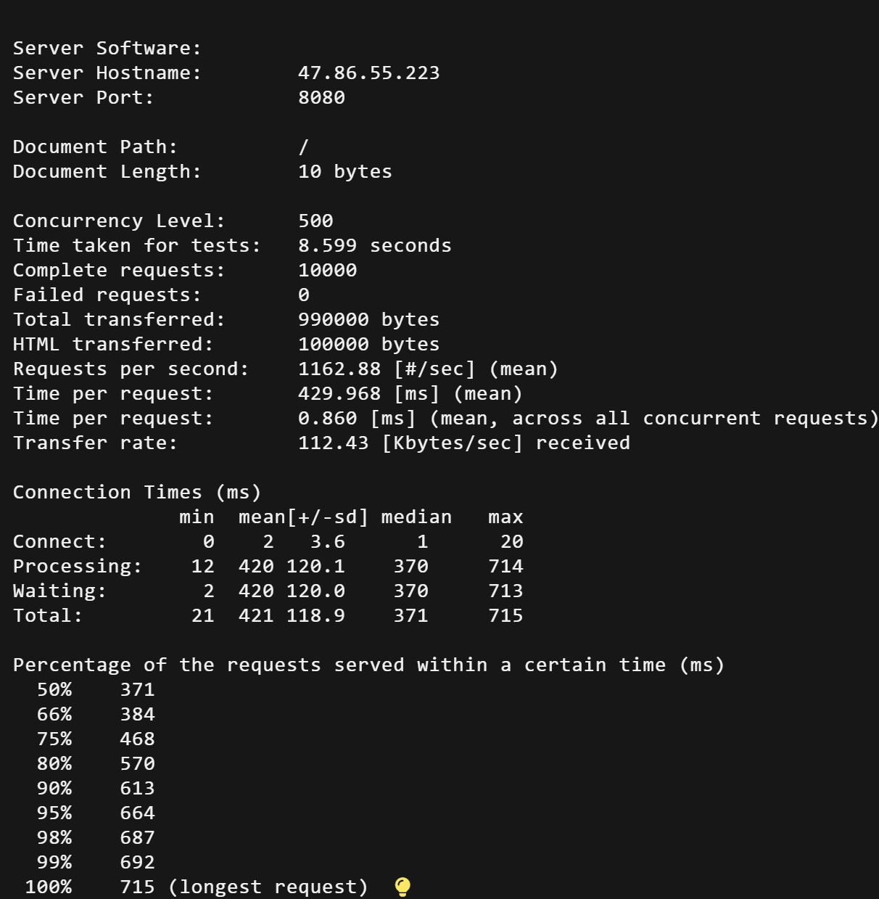
    
### 原生epoll
* 高并发测试
    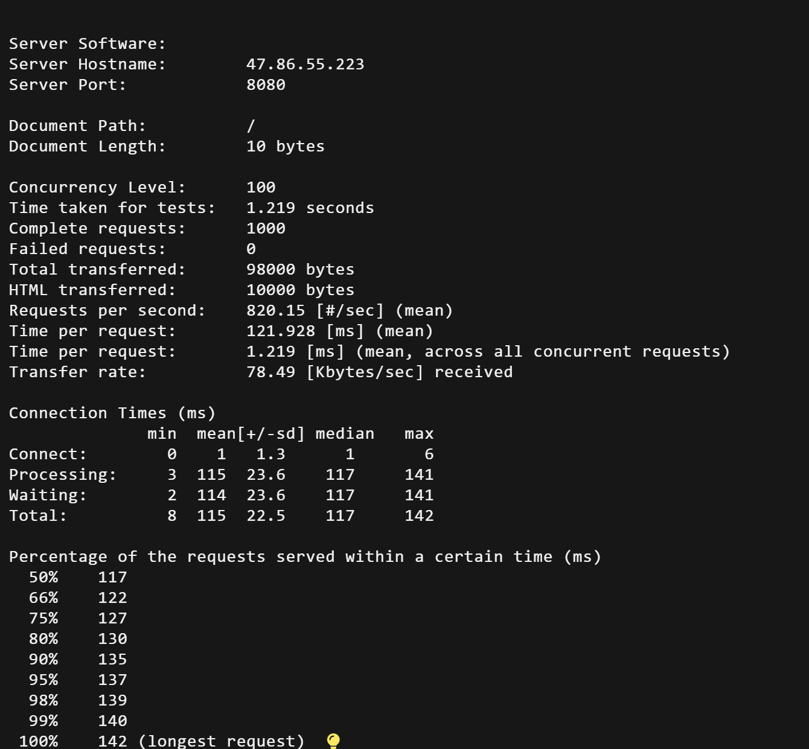
* 模拟压力测试
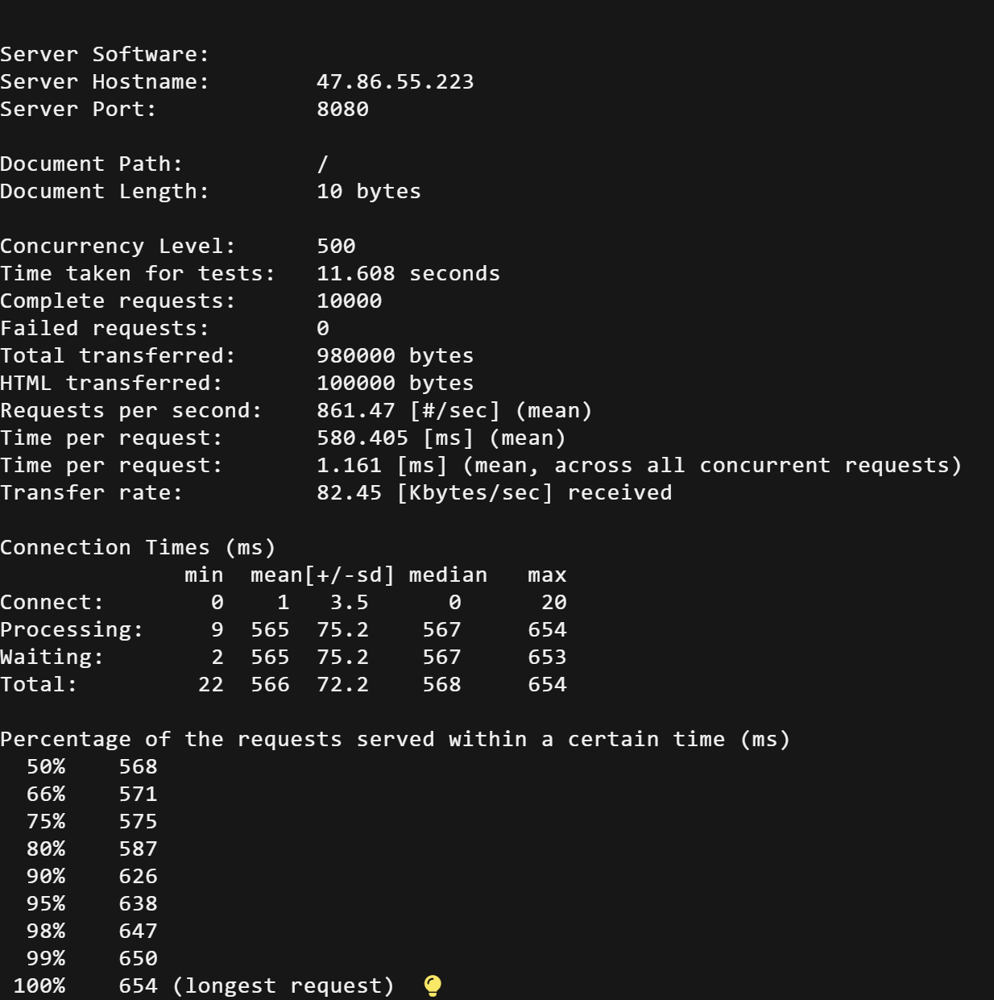

### 性能对比
通过吞吐量可以看到我们的协程库还是高出一截的

| 测试场景          | 并发数 | 指标              | 协程库 (2线程) | 原生 epoll (单线程) | 提升/变化   |
| :--------------- | :----- | :--------------- | :------------ | :----------------- | :--------- |
| **高并发测试**   | 100    | QPS (req/s)      | **1029.67**   | 820.15             | **+25.5%** |
|                  |        | 平均响应时间 (ms) | 97.118        | 121.928            | **-20.3%** |
| **持续压力测试** | 500    | QPS (req/s)      | **1162.88**   | 861.47             | **+35.0%** |
|                  |        | 平均响应时间 (ms) | 429.968       | 580.405            | **-25.9%** |

所谓术业有专攻，我们的协程库在实现更多阻塞时性能还是比epoll厉害些的

### libevent
还有一个C语言事件通知库，各位如果有兴趣可以试试
```
#include <stdio.h>
#include <stdlib.h>
#include <string.h>
#include <event2/event.h>
#include <event2/listener.h>
#include <event2/bufferevent.h>
#include <sys/socket.h>
#include <netinet/in.h>
#include <arpa/inet.h>
#include <unistd.h>

#define PORT 8080

// 处理读事件的回调函数
void http_read_cb(evutil_socket_t fd, short events, void *arg) {
    char buf[1024];
    int len = recv(fd, buf, sizeof(buf) - 1, 0);
    if (len <= 0) {
        // 发生错误或连接关闭，关闭连接并释放事件资源
        close(fd);
        event_free((struct event *)arg);
        return;
    }
    buf[len] = '\0';
    printf("接收到消息：%s\n", buf);

    // 构建HTTP响应
    const char *response = "HTTP/1.1 200 OK\r\n"
                           "Content-Type: text/plain\r\n"
                           "Content-Length: 10\r\n"
                           "Connection: keep-alive\r\n"
                           "\r\n"
                           "Good Luck!";
    send(fd, response, strlen(response), 0);

    // 发送响应后关闭连接
    close(fd);
    event_free((struct event *)arg);
}

// 接受连接的回调函数
void accept_conn_cb(evutil_socket_t listener, short event, void *arg) {
    struct event_base *base = (struct event_base *)arg;
    struct sockaddr_storage ss;
    socklen_t slen = sizeof(ss);
    int fd = accept(listener, (struct sockaddr *)&ss, &slen);
    if (fd < 0) {
        perror("accept");
    } else if (fd > FD_SETSIZE) {
        close(fd);
    } else {
        // 创建一个新的事件结构体
        struct event *ev = event_new(NULL, -1, 0, NULL, NULL);
        // 将新的事件添加到事件循环中
        event_assign(ev, base, fd, EV_READ | EV_PERSIST, http_read_cb, (void *)ev);
        event_add(ev, NULL);
    }
}

int main() {
    struct event_base *base;
    struct event *listener_event;
    struct sockaddr_in sin;

    // 初始化监听地址和端口
    memset(&sin, 0, sizeof(sin));
    sin.sin_family = AF_INET;
    sin.sin_addr.s_addr = htonl(INADDR_ANY);
    sin.sin_port = htons(PORT);

    // 创建监听套接字
    int listener = socket(AF_INET, SOCK_STREAM, 0);
    if (listener < 0) {
        perror("socket");
        return -1;
    }

    // 设置套接字选项，允许地址复用
    evutil_make_socket_nonblocking(listener);
    int reuse = 1;
    setsockopt(listener, SOL_SOCKET, SO_REUSEADDR, &reuse, sizeof(reuse));

    // 绑定地址和端口
    if (bind(listener, (struct sockaddr *)&sin, sizeof(sin)) < 0) {
        perror("bind");
        return -1;
    }

    // 监听端口
    if (listen(listener, 1024) < 0) {
        perror("listen");
        return -1;
    }

    // 初始化Libevent库
    base = event_base_new();

    // 创建一个监听事件
    listener_event = event_new(base, listener, EV_READ | EV_PERSIST, accept_conn_cb, (void *)base);

    // 将监听事件添加到事件循环中
    event_add(listener_event, NULL);

    // 开始事件循环
    event_base_dispatch(base);

    // 清理资源
    event_free(listener_event);
    event_base_free(base);
    close(listener);

    return 0;
}
```