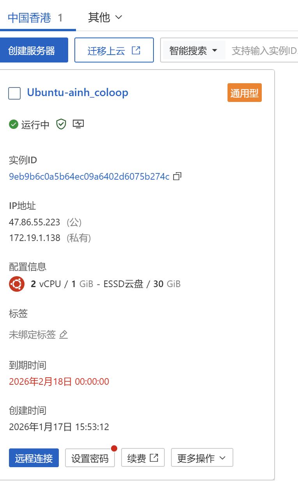

# 故事开始
## 剧场开幕
各位早上好，看到这里我应该已经做完了协程库的全部内容，现在由我来说明这个项目吧！先说结论我们到底会做什么，本项目实现了一个基于协程与多线程的高性能异步事件驱动服务器框架，采用 IO 多路复用（epoll）作为事件驱动核心，通过用户态协程实现同步风格的异步编程，并结合多线程充分利用多核资源，整体具备高并发、低延迟、易开发的特点。

看起来是有点复杂，各位会在接下来的学习中慢慢认识到这些的。
本项目涉及到C++进阶知识（回调函数，智能指针），数据结构，计算机网络（TCP连接），计算机操作系统（线程，协程）等等，覆盖的知识点横跨操作系统、网络编程、并发编程、底层开发等多个核心领域，应该算是相当优秀的学习项目了，如果各位想要借此机会学习也是完全没问题的。

作者也属于几乎的初学者，在此之前并没有接触过并发编程等，不过作者为后续模块编写了相当详细的解释，相信以各位的能力也能轻松完成。

## 参考学习
主要参考和学习了以下项目
[https://github.com/youngyangyang04/coroutine-lib/tree/main](https://github.com/youngyangyang04/coroutine-lib/tree/main)

[sylarC++高性能分布式服务器框架,](https://github.com/sylar-yin/sylar)

[[C++高级教程]从零开始开发服务器框架(sylar)](https://www.bilibili.com/video/av53602631/?from=www.sylar.top)

个人比较推荐的一些教学视频
[一起来学C++ 42. 线程](https://www.bilibili.com/video/BV18hk2Y4EAm?spm_id_from=333.788.videopod.sections&vd_source=9765ab25c3b7fd8b997b186955447f35)
这位大佬的教学视频全是干货，虽然有点硬核但是绝对讲的透彻，可以选择需要的学习观看

[深入浅出计算机网络 微课视频](https://www.bilibili.com/video/BV1NT411g7n6/?spm_id_from=333.1387.favlist.content.click&vd_source=9765ab25c3b7fd8b997b186955447f35)
如果之前没有学习过计算机网络可以看看，高军老师的这本书对计算机网络讲的相当清晰

[Linux 教程](https://www.runoob.com/linux/linux-tutorial.html) 因为我们的项目在linux系统上运行，所以各位可以在这里查查命令

## 广告时间
并非打广告，各位如果没有安装过虚拟机的话可以试着租一个服务器，新人的话二十来块就能租一个月甚至抢到半年的服务器，安装虚拟机也不是不行，可能会更麻烦一些
[阿里云服务器](https://www.aliyun.com/minisite/goods?taskCode=shareNew2205&recordId=3641992&userCode=roof0wob)
[腾讯云服务器](https://cloud.tencent.com/act?s_refer=https%3A%2F%2Fwww.yuque.com%2F)

作者租的就是一台二十块的垃圾服务器，虽然在测试时性能稍微差点，但是用起来还是比较方便的

[coloop](https://coloosp.github.io/mkdocs-site/)
作者的个人博客，里面会记录一些算法心得或者项目之类的，如果感兴趣可以稍微看看

[coloosp](https://github.com/coloosp)作者的github，如果有帮助的话可以打个星，拜托了这对我很重要😭

废话就不说了，开始我们的协程库学习吧！
